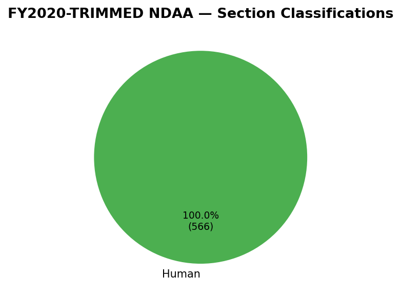
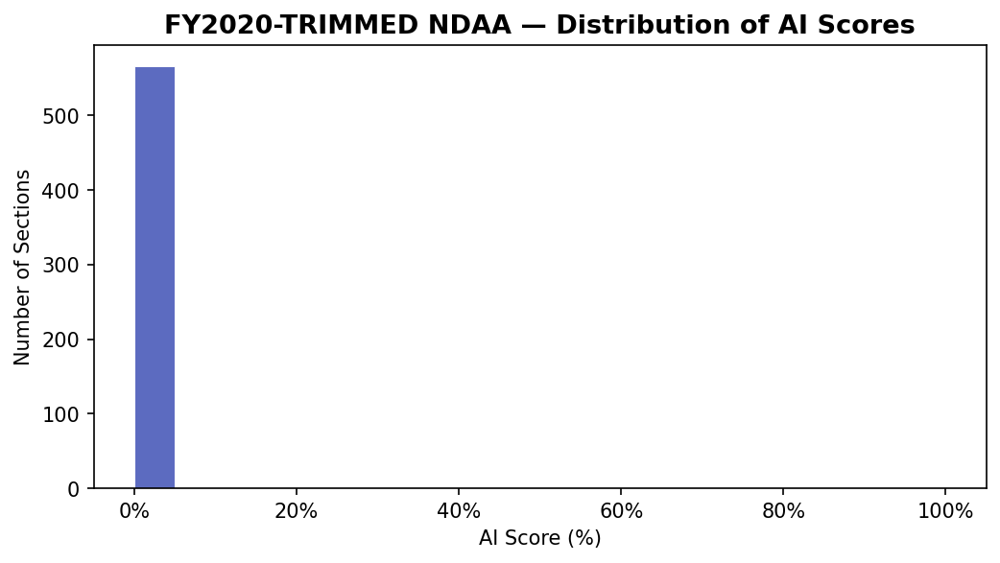
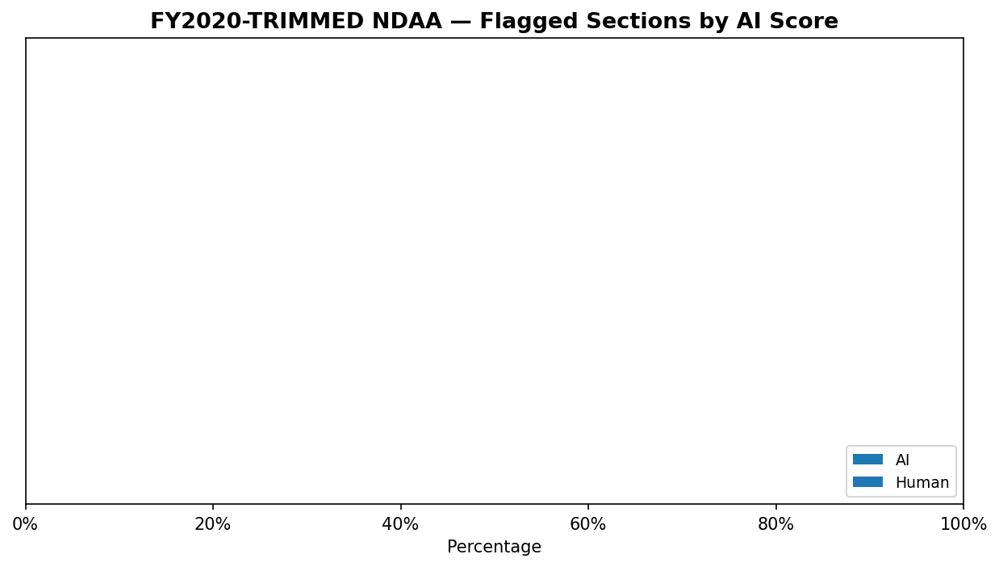
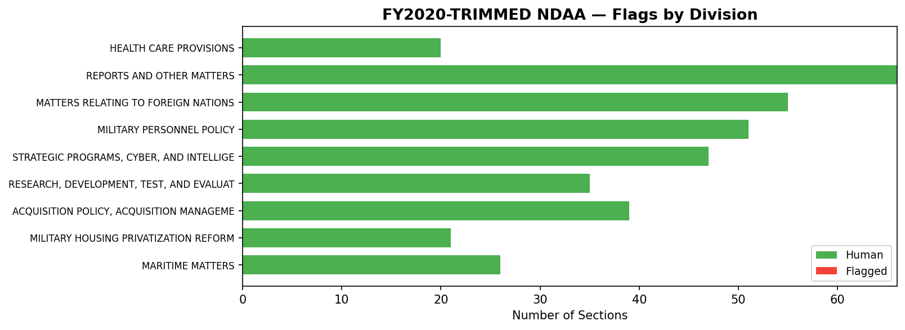

# FY2020 NDAA — AI Detection Report

**Generated:** 2026-04-01
**Detector:** Pangram v3 (`text.api.pangramlabs.com/v3`)
**Dataset:** `fy2020-trimmed`

## Dataset Coverage

The full FY2020 NDAA contains **1,217 sections** (499,647 words). To reduce API costs, sections unlikely to contain AI-generated prose were excluded prior to analysis.

| | Sections | Words |
|---|---|---|
| **Full bill** | 1,217 | 499,647 |
| **Analyzed** | 566 (46.5%) | 334,937 (67.0%) |
| **Excluded** | 651 | 164,710 |

**Exclusion reasons:**

| Reason | Sections cut |
|---|---|
| Too Short For Detection | 518 |
| Amendment To Existing Law | 106 |
| Technical Amendment | 16 |
| Table Of Contents | 4 |
| Funding Table By Number | 4 |
| Budgetary Boilerplate | 1 |
| Mostly Amendment | 1 |
| Funding Amounts | 1 |

## Summary

| Metric | Value |
|---|---|
| Sections analyzed | 566 |
| Classified Human | 566 (100.0%) |
| Classified Mixed | 0 (0.0%) |
| Classified AI | 0 (0.0%) |
| Total flagged (non-Human) | 0 (0.0%) |
| Average AI score | 0.0000 |

## Classification Breakdown

## AI Score Distribution

## Flagged Sections

## Full Text of Flagged Sections

<mark>Highlighted text</mark> indicates spans classified as AI-generated by Pangram.

## Flags by Division

## Methodology

1. The FY2020 NDAA enrolled bill XML was downloaded from govinfo.gov and parsed into individual sections.
2. Sections were filtered to exclude content unlikely to be AI-generated (table of contents, definitions, mechanical amendments to existing law, sections under 225 words, etc.).
3. Remaining sections were normalized (formatting differences removed) and sent to the Pangram v3 AI detection API.
4. Short sections (<375 words) were batched with adjacent sections in the same subtitle to provide sufficient context for detection.
5. Pangram returns per-window classifications; these were aggregated to section-level scores. Sections with 3+ windows are considered reliable; those with 1-2 windows are low-confidence.

**Limitations:** This analysis has not yet been validated against a pre-ChatGPT control (e.g., FY2020 NDAA). Without a false positive baseline, flagged sections should be treated as preliminary findings.
