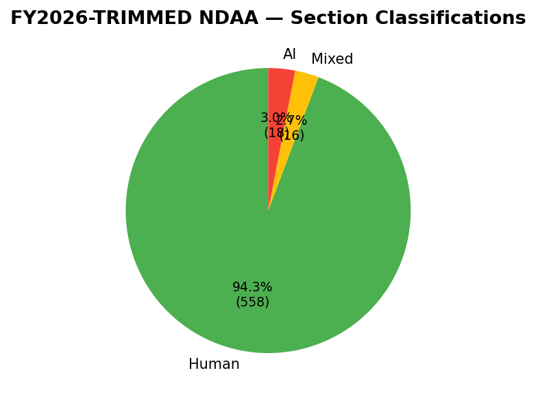
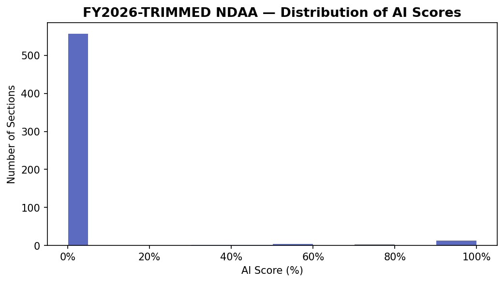
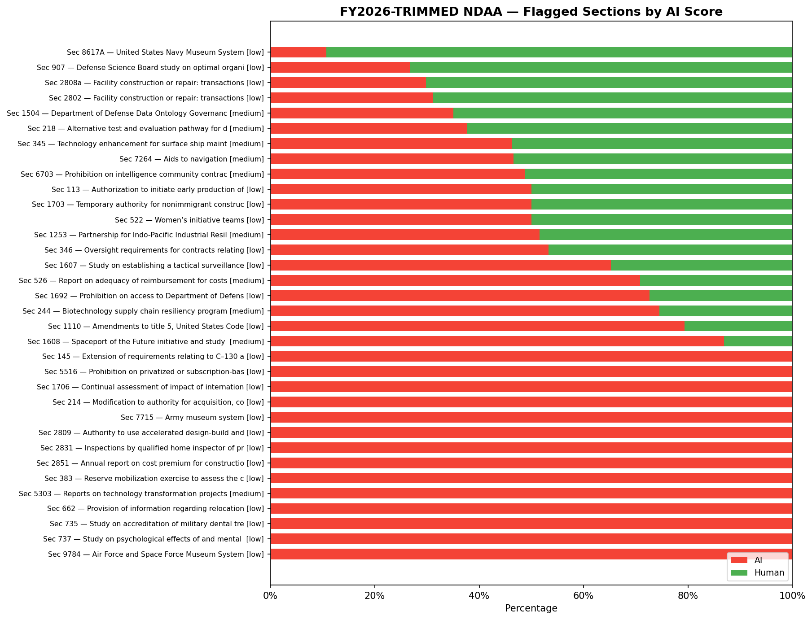
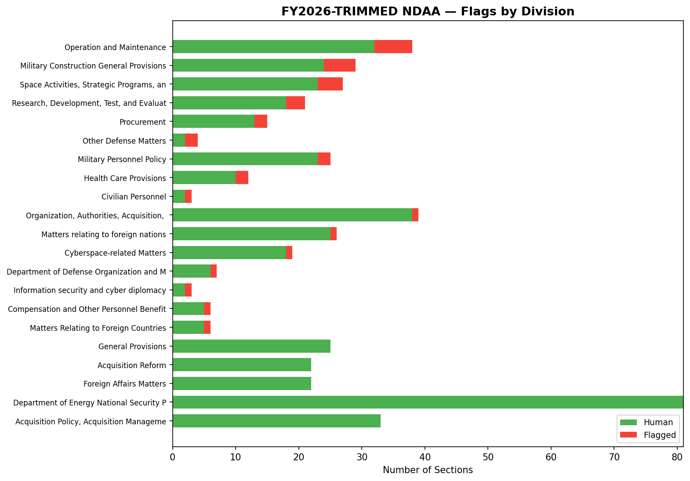

# FY2026 NDAA — AI Detection Report

**Generated:** 2026-04-01
**Detector:** Pangram v3 (`text.api.pangramlabs.com/v3`)
**Dataset:** `fy2026-trimmed`

## Dataset Coverage

The full FY2026 NDAA contains **1,311 sections** (598,738 words). To reduce API costs, sections unlikely to contain AI-generated prose were excluded prior to analysis.

| | Sections | Words |
|---|---|---|
| **Full bill** | 1,311 | 598,738 |
| **Analyzed** | 589 (44.9%) | 366,309 (61.2%) |
| **Excluded** | 722 | 232,429 |

**Exclusion reasons:**

| Reason | Sections cut |
|---|---|
| Too Short For Detection | 548 |
| Amendment To Existing Law | 111 |
| Mostly Amendment | 33 |
| Definitions | 12 |
| Table Of Contents | 4 |
| Auth Appropriations | 4 |
| Funding Table By Number | 4 |
| Budgetary Boilerplate | 1 |
| Joint Explanatory | 1 |
| Simple Extension Repeal | 1 |
| Technical Amendment | 1 |
| Too Large Non Prose | 1 |
| Funding Tables Div | 1 |

## Summary

| Metric | Value |
|---|---|
| Sections analyzed | 592 |
| Classified Human | 558 (94.3%) |
| Classified Mixed | 16 (2.7%) |
| Classified AI | 18 (3.0%) |
| Total flagged (non-Human) | 34 (5.7%) |
| Average AI score | 0.0408 |

## Classification Breakdown



## AI Score Distribution



## Flagged Sections



### Reliable Flags (3+ segments)

These sections had enough text for Pangram to analyze across multiple windows, increasing confidence in the classification.

| Sec | Title | Division | Words | Classification | AI % | Segments |
|---|---|---|---|---|---|---|
| 5303 | Reports on technology transformation projects at the De | Information security and  | 747 | AI | 100.0% | 3 |
| 1608 | Spaceport of the Future initiative and study on future  | Space Activities, Strateg | 799 | AI | 87.0% | 3 |
| 244 | Biotechnology supply chain resiliency program | Research, Development, Te | 785 | Mixed | 74.5% | 3 |
| 526 | Report on adequacy of reimbursement for costs of perman | Military Personnel Policy | 939 | Mixed | 70.9% | 3 |
| 1253 | Partnership for Indo-Pacific Industrial Resilience | Matters relating to forei | 762 | Mixed | 51.5% | 3 |
| 6703 | Prohibition on intelligence community contracting with  | Matters Relating to Forei | 778 | Mixed | 48.7% | 3 |
| 7264 | Aids to navigation | Organization, Authorities | 1181 | Mixed | 46.6% | 4 |
| 345 | Technology enhancement for surface ship maintenance | Operation and Maintenance | 708 | Mixed | 46.3% | 3 |
| 218 | Alternative test and evaluation pathway for designated  | Research, Development, Te | 937 | Mixed | 37.6% | 3 |
| 1504 | Department of Defense Data Ontology Governance Working  | Cyberspace-related Matter | 1109 | Mixed | 35.0% | 4 |

### Low-Confidence Flags (1-2 segments)

These sections were classified based on only 1-2 analysis windows. Results should be interpreted with caution.

| Sec | Title | Division | Words | Classification | AI % | Segments |
|---|---|---|---|---|---|---|
| 145 | Extension of requirements relating to C–130 aircraft | Procurement | 231 | AI | 100.0% | 1 |
| 5516 | Prohibition on privatized or subscription-based missile | Space Activities, Strateg | 315 | AI | 100.0% | 1 |
| 1706 | Continual assessment of impact of international state a | Other Defense Matters | 359 | AI | 100.0% | 1 |
| 214 | Modification to authority for acquisition, construction | Research, Development, Te | 454 | AI | 100.0% | 2 |
| 7715 | Army museum system | Operation and Maintenance | 293 | AI | 100.0% | 1 |
| 2809 | Authority to use accelerated design-build and progressi | Military Construction Gen | 710 | AI | 100.0% | 2 |
| 2831 | Inspections by qualified home inspector of privatized a | Military Construction Gen | 377 | AI | 100.0% | 2 |
| 2851 | Annual report on cost premium for construction of certa | Military Construction Gen | 425 | AI | 100.0% | 2 |
| 383 | Reserve mobilization exercise to assess the capability  | Operation and Maintenance | 578 | AI | 100.0% | 2 |
| 662 | Provision of information regarding relocation assistanc | Compensation and Other Pe | 592 | AI | 100.0% | 2 |
| 735 | Study on accreditation of military dental treatment fac | Health Care Provisions | 231 | AI | 100.0% | 1 |
| 737 | Study on psychological effects of and mental health eff | Health Care Provisions | 361 | AI | 100.0% | 1 |
| 9784 | Air Force and Space Force Museum System | Operation and Maintenance | 334 | AI | 100.0% | 1 |
| 1110 | Amendments to title 5, United States Code | Civilian Personnel | 470 | Mixed | 79.3% | 2 |
| 1692 | Prohibition on access to Department of Defense cloud-ba | Space Activities, Strateg | 474 | Mixed | 72.7% | 2 |
| 1607 | Study on establishing a tactical surveillance, reconnai | Space Activities, Strateg | 376 | Mixed | 65.2% | 2 |
| 346 | Oversight requirements for contracts relating to reloca | Operation and Maintenance | 609 | Mixed | 53.3% | 2 |
| 113 | Authorization to initiate early production of future lo | Procurement | 330 | AI | 50.0% | 2 |
| 1703 | Temporary authority for nonimmigrant construction worke | Other Defense Matters | 342 | AI | 50.0% | 2 |
| 522 | Women’s initiative teams | Military Personnel Policy | 350 | AI | 50.0% | 2 |
| 2802 | Facility construction or repair: transactions other tha | Military Construction Gen | 512 | Mixed | 31.1% | 2 |
| 2808a | Facility construction or repair: transactions other tha | Military Construction Gen | 448 | Mixed | 29.8% | 2 |
| 907 | Defense Science Board study on optimal organizational s | Department of Defense Org | 510 | Mixed | 26.8% | 2 |
| 8617A | United States Navy Museum System | Operation and Maintenance | 384 | Mixed | 10.7% | 2 |

## Full Text of Flagged Sections

### Section 5303 — Reports on technology transformation projects at the Department

**Classification:** AI | **AI Score:** 100.0% | **Segments:** 3 | **Confidence:** medium | **Division:** Information security and cyber diplomacy

<details><summary>Show full text (747 words)</summary>

```
5303. Reports on technology transformation projects at the Department

(a) Definitions

In this section:

(1) Appropriate congressional committees The term  appropriate congressional committees  means—

(A) the Committee on Foreign Affairs and the Committee on Appropriations of the House of Representatives; and

(B) the Committee on Foreign Relations and the Committee on Appropriations of the Senate.

(2) Technology The term  technology  includes—

(A) artificial intelligence and machine learning systems;

(B) cybersecurity modernization tools or platforms;

(C) cloud computing services and infrastructure;

(D) enterprise data platforms and analytics tools;

(E) customer experience platforms for public-facing services; and

(F) internal workflow automation or modernization systems.

(3) Technology transformation project

(A)

In general The term  technology transformation project  means any new or significantly modified technology deployed by the Department with the purpose of improving diplomatic, consular, administrative, or security operations.

(B) Exclusions The term  technology transformation project  does not include a routine software update or version upgrade, a security patch or maintenance of an existing system, a minor configuration change, a business-as-usual information technology operation, a support activity, or a project that costs less than $1,000,000.

(b) Annual report

(1)

In general

Not later than 180 days after the date of the enactment of this Act, and annually thereafter for five years, the Secretary shall submit to the appropriate congressional committees a report on all technology transformation projects completed during the preceding two fiscal years.

(2) Elements Each report required by paragraph

(1) shall include the following elements:

(A) For each project, the following:

(i) A summary of the objective, scope, and operational context of the project.

(ii) An identification of the primary technologies and vendors used, including artificial intelligence models, cloud providers, cybersecurity platforms, and major software components.

(iii) A report on baseline and post-implementation performance and adoption metrics for the project, including (if applicable) with respect to—

(I) operational efficiency, such as reductions in processing time, staff hours, or error rates; (II) user impact, such as improvements in end-user satisfaction scores and reliability; (III) security posture, such as enhancements in threat detection, incident response time; (IV) cost performance, including budgeted costs versus actual costs and projected cost savings or cost avoidance;

(V) interoperability and integration, including level of integration achieved with existing systems of the Department; (VI) artificial intelligence, if applicable; and (VII) adoption, including, if applicable— (aa) an estimate of the percentage of eligible end-users actively using the system within the first three, six, and 12 months of deployment; (bb) the proportion of staff trained to use the system; (cc) the frequency and duration of use, disaggregated by bureau or geographic region if relevant; (dd) summarized user feedback, including pain points and satisfaction ratings; and (ee) a description of the status of deprecation or reduction in use of legacy systems, if applicable.

(iv) A description of key challenges encountered during implementation and any mitigation strategies employed.

(v) A summary of contracting or acquisition strategies used, including information on how the vendor or development team supported change management and adoption, including user testing, stakeholder engagement, and phased rollout.

(B) For any project where adoption metrics fell below 50 percent of estimated usage within six months of launch, the following:

(i) A remediation plan with specific steps to improve adoption, including retraining, user experience improvements, or outreach.

(ii) An assessment of whether rollout should be paused or modified.

(iii) Any plans for iterative development based on feedback from employees.

(3) Public summary

Not later than 60 days after submitting a report required by paragraph

(1) to the appropriate congressional committees, the Secretary shall publish an unclassified summary of the report on the publicly accessible website of the Department, consistent with national security interests.

(c) Government accountability office evaluation

Not later than 18 months after the date of the enactment of this Act, and biennially thereafter, the Comptroller General of the United States shall submit to the appropriate congressional committees a report—

(1) evaluating—

(A) the extent to which the Department has implemented and reported on technology transformation projects in accordance with the requirements under this section;

(B) the effectiveness and reliability of the Department’s performance and adoption metrics for such projects;

(C) whether such projects have met intended goals related to operational efficiency, security, cost-effectiveness, user adoption, and modernization of legacy systems; and

(D) the adequacy of oversight mechanisms in place to ensure the responsible deployment of artificial intelligence and other emerging technologies; and

(2) including any recommendations to improve the Department’s management, implementation, or evaluation of technology transformation efforts.
```

</details>

---

### Section 1608 — Spaceport of the Future initiative and study on future space launch capacity

**Classification:** AI | **AI Score:** 87.0% | **Segments:** 3 | **Confidence:** medium | **Division:** Space Activities, Strategic Programs, and Intelligence Matters

<details><summary>Show full text (799 words)</summary>

```
1608. Spaceport of the Future initiative and study on future space launch capacity

(a) Study

(1) Requirement

The Secretary of the Air Force shall conduct a study, as part of the Spaceport of the Future initiative, to—

(A) assess the operational capacity, infrastructure, and long-term sustainability of space launch sites at Cape Canaveral Space Force Station, Florida, and Vandenberg Space Force Base, California, including with respect to heavy and super heavy launches from such sites;

(B) evaluate the suitability of such sites for ongoing and future missions;

(C) explore alternate launch locations that may offer advantages in mission efficiency, cost-effectiveness, or strategic value; and

(D) assess the feasibility of incorporating other active spaceports into the national security launch infrastructure of the Department of Defense.

(2) Elements The study under paragraph

(1) shall include the following:

(A) An analysis of the current capacity and use of the launch sites (as of the date of the study) at Cape Canaveral Space Force Station and Vandenberg Space Force Base, including with respect to existing infrastructure, launch frequencies, and operational efficiency.

(B) A detailed evaluation of the infrastructure at Cape Canaveral Space Force Station and Vandenberg Space Force Base, including with respect to transportation access, environmental considerations, safety protocols, the adequacy of current facilities (as of the date of the study), and the estimated costs of maintaining and upgrading such infrastructure.

(C) A review of environmental regulations, policies, and potential effects relating to space launches at Cape Canaveral Space Force Station and Vandenberg Space Force Base, including any limitations or challenges imposed by Federal, State, or local regulations and an evaluation of potential strategies to mitigate adverse environmental effects.

(D) A comparative analysis of alternate locations for space launches, including sites on Federal lands, private land partnerships, and locations outside the continental United States, taking into account—

(i) geographic and orbital dynamic considerations; and

(ii) environmental, logistical, and regulatory factors that may make alternate locations viable or advantageous, including cost comparisons and potential challenges in establishing infrastructure at such locations.

(E) An examination of the manner in which Cape Canaveral Space Force Station, Vandenberg Space Force Base, and any potential alternate locations align with national defense and space exploration goals, including with respect to launch site proximity to key orbital paths, security considerations, and redundancy for critical missions.

(F) An exploration of the manner in which advancements in space launch technology, including with respect to reusable launch vehicles and space traffic management, could influence the future demand and operational needs for space launch sites.

(G) An assessment of any innovative technologies that could enhance the capacity or reduce the environmental impact of existing or alternate space launch sites.

(H) A financial analysis of the long-term costs associated with the use and maintenance of Cape Canaveral Space Force Station and Vandenberg Space Force Base for space launches, and the estimated costs for establishing and operating alternative space launch sites, including considerations applicable to Government funding, private sector partnerships, and cost-sharing models.

(I) An assessment of additional funding required to implement the Spaceport of the Future initiative, including the status, estimated completion dates, and total cost of projects, whether at Federal, State, or commercial space launch facilities.

(J) Identification of other coastal locations throughout the continental United States that would be suitable for development to expand national security launch infrastructure.

(K) A review of Federal authorities, policies, and statutes that may inhibit expansion of launch infrastructure at existing Department of Defense launch sites.

(3) Consultation

The Secretary shall carry out the study under paragraph

(1) in consultation with relevant stakeholders, including commercial space industry representatives, environmental agencies, and local governments.

(b) Report

(1) Initial report

Not later than March 31, 2026, the Secretary shall submit to the congressional defense committees a report on the findings of the study under subsection

(a).

(2) Elements The report under paragraph

(1) shall include—

(A) recommendations on the future use of space launch sites at Cape Canaveral Space Force Station, Vandenberg Space Force Base, and alternate locations;

(B) a summary of findings and recommendations on the continued use of Cape Canaveral Space Force Station and Vandenberg Space Force Base for space launches;

(C) a detailed analysis of alternate launch sites, including with respect to strategic, operational, and financial considerations;

(D) policy recommendations for addressing infrastructure needs, environmental concerns, and regulatory challenges for space launch operations; and

(E) a summary of the status, estimated completion dates, total cost, and funding required for projects under the Spaceport of the Future initiative.

(3) Annual updates

Not later than March 31 of each of 2027 through 2031, the Secretary shall submit to the congressional defense committees on the Spaceport of the Future initiative, including with respect to project status, estimated completion dates, total costs, and any updated assessments of funding or infrastructure needs.
```

</details>

---

### Section 244 — Biotechnology supply chain resiliency program

**Classification:** Mixed | **AI Score:** 74.5% | **Segments:** 3 | **Confidence:** medium | **Division:** Research, Development, Test, and Evaluation

<details><summary>Show full text (785 words)</summary>

```
244. Biotechnology supply chain resiliency program

(a) Authorization

(1)

In general

The Secretary of Defense, in coordination with the Secretaries of the military departments and the heads of relevant Defense Agencies, may establish and implement a program (referred to in this section as the  Program ) to develop and scale within the laboratories of the military departments, and transition from the laboratories of the military departments, biotechnology-based technologies and capabilities (including products such as chemicals, materials, and fuels) that are relevant to the mission of the Department of Defense and support the resilience, sustainability, and responsiveness of the defense supply chain.

(2) Activities Under the Program, the Secretary of Defense may carry out the following activities:

(A) Conduct an assessment of supply chain vulnerabilities in the Department of Defense.

(B) Direct the laboratories of the military departments to establish mechanisms to collaboratively—

(i) conduct applied research, including experimentation, advanced technological development, advanced component development, and rapid prototyping in bioindustrials, biomanufacturing, and related disciplines to support defense missions;

(ii) develop, prototype, test, and transition biologically derived materials and products to reduce reliance on foreign supply chains and vulnerable supply chains;

(iii) upgrade, expand, or construct physical and digital infrastructure, including laboratory facilities, of the Department and its partners to support bioindustrial research, development, testing, prototyping, and production;

(iv) as needed, enter into contracts, cooperative agreements, grants, or other transactions with relevant Federal entities and non-Federal entities, such as commercial entities, research institutions, and academic organizations, to execute the activities under this subparagraph

(B); and

(v) support education, training, and workforce development initiatives to build and sustain a skilled bioindustrial and biomanufacturing workforce.

(C) Collaborate across the military departments, Defense Agencies, and other Federal entities to ensure alignment with national bioindustrial and supply chain strategies.

(D) Promote the development and utilization of next-generation feedstocks and processes in ways that support local economic growth.

(E) Modernize infrastructure through investment in facilities that enable rapid prototyping and advanced materials testing.

(F) Establish performance metrics and benchmarks to measure progress toward operational integration and transition to programs of record.

(3) Other considerations In the event the Secretary of Defense carries out the Program, the Secretary shall—

(A) prioritize technologies and capabilities that address critical defense supply chain vulnerabilities and enhance military readiness, including technologies and capabilities necessary to—

(i) reduce logistics through field-enabled manufacturing of materials and deployable infrastructure components;

(ii) enhance performance through development of novel materials; or

(iii) improve cost efficiency of manufacturing and reduce dependency on foreign supply chains;

(B) consult with representatives of industry, academia, and other Federal agencies with relevant expertise, to accelerate development and transitions; and

(C) ensure the Program supports the development and fielding of emerging technologies such as biotechnologies that provide operational and strategic advantages to the Armed Forces, including through—

(i) cross-service and public-private partnerships; and

(ii) applied research, pilot-scale production, and technology transition efforts focused on biomanufacturing and materials innovation.

(b) Reports

(1) Submission

Not later than one year after commencing the Program, and biennially thereafter until the Program terminates under subsection

(c), the Secretary of Defense shall submit to the Committees on Armed Services of the Senate and the House of Representatives a report detailing all activities carried out under the program. Each report shall include, to the extent applicable, the following:

(A) A summary of key research, development, and prototyping efforts initiated or continued during the year or years covered by the report, including technical objectives, anticipated defense applications, and funding.

(B) A list of significant partnerships or agreements executed with industry, academic institutions, and other Federal agencies, including the purpose, national security nexus, and funding level of each such partnership or agreement.

(C) An assessment of infrastructure enhancements undertaken to support bioindustrial development and scale-up, including facility modernization and equipment acquisition.

(D) An evaluation of program performance against established milestones or metrics, including progress toward the transition of technologies to operational use or acquisition programs.

(E) An identification of major technical, logistical, or policy challenges encountered, and actions taken to mitigate such challenges.

(2) Form Each report under this subsection shall be submitted in unclassified form but may contain a classified annex.

(c) Sunset

(1)

In general Except as provided in paragraph

(2), the authority to carry out the Program shall terminate on the date that is 10 years after the date of the enactment of this Act.

(2) Extension The Program may be continued after the termination date specified in paragraph

(1) if, before such date, the President—

(A) determines that continuation of the Program is necessary to meet national economic or national security needs; and

(B) submits notice of such determination to the Committees on Armed Services of the Senate and the House of Representatives.
```

</details>

---

### Section 526 — Report on adequacy of reimbursement for costs of permanent change of station

**Classification:** Mixed | **AI Score:** 70.9% | **Segments:** 3 | **Confidence:** medium | **Division:** Military Personnel Policy

<details><summary>Show full text (939 words)</summary>

```
526. Report on adequacy of reimbursement for costs of permanent change of station

(a) Report required

Not later than March 31, 2028, the Secretary of Defense shall submit to the Committees on Armed Services of the Senate and the House of Representatives a report on the adequacy of reimbursements for expenses incurred by members of the Armed Forces undergoing a permanent change of station.

(b) Survey requirements In preparing the report required under subsection

(a), the Secretary of Defense shall—

(1) conduct a comprehensive survey of not fewer than 10,000 members of the Armed Forces who complete a permanent change of station during fiscal year 2026 or 2027 that—

(A) collects detailed information on actual expenses incurred, both reimbursed and unreimbursed;

(B) includes options for members to upload receipts and documentation electronically, provided that such uploads are supplemental and optional;

(C) is designed to ensure statistical validity;

(D) achieves response rates sufficient to ensure representative samples from each military department and pay grade category; and

(E) includes questions regarding financial stress, debt incurrence, and impact on military retention decisions;

(2) conduct follow-up surveys with a subset of respondents to gather additional detail on specific cost categories;

(3) survey military spouses separately regarding employment-related costs and career impacts of permanent changes of station; and

(4) consult with military relief societies regarding financial assistance patterns and trends relating to permanent changes of station.

(c) Elements

(1) Analysis of reimbursement categories

(A) Analysis For each of the categories described in subparagraph

(B), the report required by subsection

(a) shall include—

(i) an identification of all expenses intended to be covered;

(ii) an identification of related expenses that are not covered;

(iii) the average actual costs incurred by members of the Armed Forces for both covered and uncovered expenses, based on survey data from not fewer than 10,000 permanent changes of station conducted during fiscal years 2025 and 2026, accounting for peak and non-peak cycles;

(iv) a comparison of actual costs to reimbursement amounts;

(v) a justification for the inclusion or exclusion of specific expenses; and

(vi) recommendations for modifications to coverage or reimbursement rates.

(B) Categories The categories described in this subparagraph are as follows:

(i) Dislocation allowance.

(ii) Temporary lodging expense and temporary lodging allowance.

(iii) Per diem allowances.

(iv) Monetary allowance in lieu of transportation.

(v) Personally procured move reimbursements.

(vi) Household goods shipment and storage entitlements.

(vii) Dependent travel allowances.

(viii) Pet transportation reimbursement.

(ix) Any other allowances or reimbursements related to permanent changes of station.

(2) Uncovered expense analysis The report required under subsection

(a) shall include an examination of expenses commonly incurred but not reimbursed, including—

(A) security deposits and advance rent payments;

(B) utility and telecommunication connection and disconnection fees;

(C) contract termination penalties;

(D) State vehicle registration and driver’s license fees;

(E) pet transportation costs;

(F) temporary storage beyond authorized limits;

(G) childcare registration for dependents; and

(H) replacement of household items damaged or unsuitable for new location.

(3) Financial impact assessment The report required under subsection

(a) shall include an analysis of the financial impact of permanent changes of station on members of the Armed Forces, including—

(A) average out-of-pocket expenses by pay grade;

(B) percentage of members incurring debt due to expenses related to a permanent change of station;

(C) impact on the emergency savings of members of the Armed Forces; and

(D) utilization rates of military relief society assistance for financial hardship relating to permanent changes of station.

(4) Methodology for future adjustments The report required under subsection

(a) shall include recommendations for establishing an annual review and adjustment process for reimbursements for costs relating to a permanent change of station that accounts for—

(A) inflation and cost-of-living changes;

(B) regional variations in moving costs, including those related to status of forces agreements, currency fluctuation, local housing markets, and pet importation or quarantine requirements;

(C) changes in typical household composition and needs; and

(D) emerging categories of relocation expenses.

(d) Disaggregation requirements The report required by subsection

(a) shall include all data disaggregated by—

(1) permanent changes of station within the continental United States;

(2) permanent changes of station from the continental United States to locations outside the continental United States;

(3) permanent changes of station from locations outside the continental United States to the continental United States;

(4) permanent changes of station between locations outside the continental United States;

(5) pay grade of the members undergoing a permanent change of station;

(6) family status of the member;

(7) distance between the permanent station from which the member is transferring to the permanent station to which the member is transferring;

(8) duty status of the member;

(9) whether the member participates in the Exceptional Family Member Program; and

(10) origin and destination installation.

(e) Data integration The report shall, to the maximum extent practicable, incorporate and reconcile data from existing systems of the Department of Defense.

(f) Data privacy and custody

(1)

In general

The Secretary of Defense shall ensure that all data collected to carry out this section remains under the custody and control of the Department of Defense.

(2) Use of contractors

The Secretary shall prohibit any contractor supporting implementation of this section from use of data collected to carry out this section other than for purposes of this section, including with respect to use in artificial intelligence model training, commercial applications, or other derivative purposes.

(g) Interim briefing

Not later than March 31, 2027, the Secretary of Defense shall provide the Committees on Armed Services of the Senate and the House of Representatives an interim briefing on preliminary findings and anticipated recommendations of the report required under subsection

(a).
```

</details>

---

### Section 1253 — Partnership for Indo-Pacific Industrial Resilience

**Classification:** Mixed | **AI Score:** 51.5% | **Segments:** 3 | **Confidence:** medium | **Division:** Matters relating to foreign nations

<details><summary>Show full text (762 words)</summary>

```
1253. Partnership for Indo-Pacific Industrial Resilience

(a) Establishment

The Secretary of Defense, in coordination with the Secretary of State, shall establish and maintain an initiative, to be known as the  Partnership for Indo-Pacific Industrial Resilience  (referred to in this section as the  Initiative ), to strengthen cooperation among the defense industrial bases of the United States and allied and partner countries in the Indo-Pacific region and other countries supporting Indo-Pacific defense industrial resilience.

(b) Objectives The objectives of the Initiative shall be the following:

(1) To enable the production and supply of the material necessary for equipping the Armed Forces of the United States and the military forces of allied and partner countries to achieve—

(A) the objectives set forth in the most recent national security strategy report submitted to Congress by the President pursuant to section 108 of the National Security Act of 1947 ( 50 U.S.C. 3043 );

(B) the policy guidance of the Secretary of Defense provided pursuant to section 113

(g) of title 10, United States Code; and

(C) the future-years defense program submitted to Congress by the Secretary of Defense pursuant to section 221 of title 10, United States Code.

(2) To strengthen the collective defense industrial base by expanding industrial base capability, capacity, and workforce, including with respect to enhanced supply chain security, interoperability, and resilience among participating countries.

(3) To identify and mitigate industrial base vulnerabilities across partner countries.

(4) To advance research and development activities to provide the Armed Forces of the United States and the military forces of allied and partner countries with systems capable of ensuring technological superiority over potential adversaries.

(5) To promote co-development, co-production, and procurement collaboration in key defense sectors.

(6) To promote defense innovation, improve information sharing, encourage standardization, reduce barriers to cooperation, and otherwise mitigate potential vulnerabilities and facilitate collaboration.

(7) Any other matter the Secretary of Defense considers appropriate.

(c) Designation of senior official

(1)

In general

Not later than 180 days after the date of the enactment of this Act, the Secretary of Defense shall designate a senior civilian official of the Department of Defense at the Assistant Secretary level or above to lead relevant efforts of the Initiative, as determined by the Secretary.

(2) Notification

Not later than 30 days after the date on which the Secretary of Defense makes or changes a designation under paragraph

(1), the Secretary shall submit to the congressional defense committees a notification of such designation or change.

(d) Participation

The Secretary of Defense, in coordination with the Secretary of State, shall establish a process to determine which allies and partners of the United States (including Australia, Japan, the Republic of Korea, India, the Philippines, and New Zealand) shall be invited to participate as member countries of the Initiative.

(e) Authorities To carry out this section, the Secretary of Defense may do the following:

(1) Enter into agreements and memoranda of understanding with appropriate counterparts from participating countries.

(2) Establish working groups and technical exchanges.

(3) Provide technical assistance and capacity-building support to partner countries using authorities available to the Secretary under title 10, United States Code.

(4) Engage with industry, capital providers, academia, and any other stakeholders necessary to advance the objectives described in subsection

(b).

(f) Report and briefing

(1) Report

(A)

In general

Not later than March 1, 2027, and annually thereafter through 2031, the Secretary of Defense shall submit to the congressional defense committees, the Committee on Foreign Affairs of the House of Representatives, and the Committee on Foreign Relations of the Senate a report on the status and progress of the Initiative.

(B) Elements Each report required by subparagraph

(A) shall include the following:

(i) An assessment of shared industrial base vulnerabilities.

(ii) An overview of efforts among participating countries to enhance supply chain integrity and resilience.

(iii) A description of any joint defense production or co-development initiative, including any such initiative involving sensitive or classified technologies.

(iv) An articulation of priority initiatives for the upcoming fiscal year.

(v) Recommendations for legislative, regulatory, policy, or resourcing changes to achieve the objectives described in subsection

(b).

(vi) Any other matter the Secretary of Defense considers appropriate.

(2) Briefing

Not later than December 1, 2026, and annually thereafter through 2030, the Secretary of Defense shall provide the congressional defense committees, the Committee on Foreign Affairs of the House of Representatives, and the Committee on Foreign Relations of the Senate with a briefing on the progress made toward achieving the objectives described in subsection

(b).

(g) Termination The authority under this section shall terminate on December 31, 2030.
```

</details>

---

### Section 6703 — Prohibition on intelligence community contracting with Chinese military companies engaged in biotechnology research, development, or manufacturing

**Classification:** Mixed | **AI Score:** 48.7% | **Segments:** 3 | **Confidence:** medium | **Division:** Matters Relating to Foreign Countries

<details><summary>Show full text (778 words)</summary>

```
6703. Prohibition on intelligence community contracting with Chinese military companies engaged in biotechnology research, development, or manufacturing

(a) Definitions

In this section:

(1) 1260H list The term  1260H list  means the list of Chinese military companies operating in the United States most recently submitted under section 1260H

(b)

(1) of the William M. (Mac) Thornberry National Defense Authorization Act for Fiscal Year 2021 ( 10 U.S.C. 113  note).

(2) Affiliate The term  affiliate  means an entity that directly or indirectly controls, is controlled by, or is under common control with another entity.

(3) Biotechnology The term  biotechnology  means the use of biological processes, organisms, or systems for manufacturing, research, or medical purposes, including genetic engineering, synthetic biology, and bioinformatics.

(b) Prohibition Subject to subsections

(d) and

(e), a head of an element of the intelligence community may not enter into, renew, or extend any contract for a product or service with—

(1) any entity listed on the 1260H list that is engaged in biotechnology research, development, or manufacturing activities;

(2) any entity that is a known or assessed affiliate of any entity described in paragraph

(1);

(3) any entity that has a known or assessed joint venture, partnership, or contractual relationship with any entity described in paragraph

(1), if the Director of National Intelligence determines that the relationship presents a risk to the national security of the United States; or

(4) any other entity that is engaged in biotechnology research, development, or manufacturing activities, if the Director of National Intelligence determines that the activities present a risk to the national security of the United States.

(c) Implementation and compliance

The Director of National Intelligence shall, in consultation with the heads of the elements of the intelligence community—

(1) establish guidelines for the implementation of this section;

(2) maintain both a publicly available and classified list of entities covered by the prohibition in subsection

(b);

(3) require that each head of an element of the intelligence community ensure that any contractor engaged by the element certify that neither it nor any of its subcontractors are engaged in a contract for a product or service with an entity covered by the prohibition in subsection

(b); and

(4) otherwise ensure compliance with subsection

(b).

(d) Waiver process

(1)

In general

The Director of National Intelligence may establish a waiver process for the heads of the elements of the intelligence community under which the head of the relevant element may waive the prohibition under subsection

(b) for a procurement on a case-by-case basis. A waiver may be made under the process only if the head of the relevant element—

(A) complies with any conditions the Director may establish for the process; and

(B) determines, in writing, that—

(i) the procurement is essential for national security and no reasonable alternative source exists; and

(ii) appropriate measures are in place to mitigate risks associated with the procurement.

(2) Congressional notification For each waiver for a procurement issued under subsection

(b), the Director and the relevant head of the element of the intelligence community shall, not later than 30 days after issuing the waiver, submit to the congressional intelligence committees, the Committee on Appropriations of the Senate, and the Committee on Appropriations of the House of Representatives a notice of the waiver, which shall include a justification for the waiver and a description of the risk mitigation measures implemented for the procurement.

(e) Exceptions The prohibition in subsection

(b) shall not apply to—

(1) the acquisition or provision of health care services overseas for—

(A) employees of the United States, including members of the uniformed services (as defined in section 101

(a) of title 10, United States Code), whose official duty stations are located overseas or who are on permissive temporary duty travel overseas; or

(B) employees of contractors or subcontractors of the United States—

(i) who are performing under a contract that directly supports the missions or activities of individuals described in subparagraph

(A); and

(ii) whose primary duty stations are located overseas or who are on permissive temporary duty travel overseas; or

(2) the acquisition, use, or distribution of human multiomic data, lawfully compiled, that is commercially or publicly available.

(f) Effective date This section shall take effect on the date that is 60 days after the date of the enactment of this Act and apply to any contract entered into, renewed, or extended on or after such effective date.

(g) Sunset The provisions of this section shall terminate on the date that is 10 years after the date of the enactment of this Act.

(h) Rule of construction This section shall only be construed to apply to activities of an element of the intelligence community.
```

</details>

---

### Section 7264 — Aids to navigation

**Classification:** Mixed | **AI Score:** 46.6% | **Segments:** 4 | **Confidence:** medium | **Division:** Organization, Authorities, Acquisition, and Personnel of the Coast Guard

<details><summary>Show full text (1181 words)</summary>

```
7264. Aids to navigation

(a) Discontinuance of aid to navigation

(1)

In general Subchapter III of  chapter 5  of title 14, United States Code, is amended—

(A) by redesignating the second section 548 as section 551; and

(B) by adding at the end the following: 552. Discontinuance of aid to navigation

(a)

In general

Not later than 180 days after the date of enactment of this section, the Secretary shall establish a process for the discontinuance of an aid to navigation (other than a seasonal or temporary aid) established, maintained, or operated by the Coast Guard.

(b) Requirement The process established under subsection

(a) shall include procedures—

(1) to notify the public of any discontinuance of an aid to navigation described in that subsection; and

(2) to safeguard against any discontinuation that may compromise the safety of mariners or the public or hinder maritime operational readiness, including with respect to food security and maritime transportation.

(c) Consultation In establishing a process under subsection

(a), the Secretary shall consult with and consider any recommendations of—

(1) the Navigation Safety Advisory Council; and

(2) with respect to aids to navigation established, maintained, or operated by the Coast Guard and located in the coastal or inland waterways of a State, the public of such State and relevant stakeholders, including—

(A) State agencies;

(B) State, local, and Tribal law enforcement, fire, and emergency response agencies;

(C) Indian Tribes;

(D) port;

(E) pilots;

(F) harbormasters;

(G) commercial and recreational fishermen, including fishing associations;

(H) ferry operators;

(I) marina operators;

(J) recreational boaters;

(K) passenger vessel operators; and

(L) coastal residents.

(d) Notification

Not later than 30 days after the date on which the process is established under subsection

(a), the Secretary shall notify the Committee on Commerce, Science, and Transportation of the Senate and the Committee on Transportation and Infrastructure of the House of Representatives of such process. .

(2) Clerical amendment The analysis for  chapter 5  of title 14, United States Code, is amended—

(A) by striking the item relating to the second section 548; and

(B) by adding at the end the following: 551. Marking anchorage grounds by Commandant of the Coast Guard.  552. Discontinuance of aid to navigation. .

(b) Report on condition of aids to navigation on the Missouri River

(1) Report to Congress

Not later than 270 days after the date of enactment of this Act, the Commandant shall submit to the Committee on Transportation and Infrastructure of the House of Representatives and the Committee on Commerce, Science, and Transportation of the Senate a report on the condition of dayboards and the placement of buoys on the Missouri River.

(2) Elements The report under paragraph

(1) shall include—

(A) a list of the most recent date on which each dayboard and buoy was serviced by the Coast Guard;

(B) an overview of the plan of the Coast Guard to systematically service each dayboard and buoy on the Missouri River; and

(C) assigned points of contact.

(c) Report on condition of aids to navigation

(1) Report to Congress

Not later than 270 days after the date of enactment of this Act, the Executive Director of the Committee on Marine Transportation System shall submit to the Committee on Transportation and Infrastructure of the House of Representatives and the Committee on Commerce, Science, and Transportation of the Senate a report on the condition of dayboards and the placement of buoys in Coast Guard Northeast District, and Coast Guard Northwest District.

(2) Elements The report under paragraph

(1) shall include—

(A) a list of the most recent date on which each dayboard and buoy was serviced by the Coast Guard;

(B) an overview of the plan of the Coast Guard to systematically service each buoy located in the Coast Guard Northeast District;

(C) an overview of the plan of the Coast Guard to systematically service each buoy located in the Coast Guard Northwest District; and

(D) assigned points of contact.

(3) Limitation Beginning on the date of enactment of this Act, the Commandant may not remove the aids to navigation covered in paragraph

(1), unless there is an imminent threat to life or safety, until a period of 180 days has elapsed following the date on which the Commandant submits the report required under paragraph

(1).

(4) Study on reliance on aids to navigation

(A)

In general The Executive Director of the Committee of Marine Transportation System Commandant shall conduct a study on the extent to which physical aids to navigation, including buoys and dayboards, are relied upon by maritime users in the Missouri River, Coast Guard Northeast District, and Coast Guard Northwest District.

(B) Requirements In the study conducted under subparagraph

(A), the Commandant shall include the following:

(i) An analysis of the extent to which physical aids to navigation serve as primary navigational references for operators of vessels that lack electronic or satellite-based systems, including small commercial vessels, recreational boats, sailboats, and skiffs.

(ii) An assessment of the role physical aids to navigation play in supporting safe vessel operation during outages, disruptions, or inaccuracies in electronic or satellite-based navigation systems.

(iii) An assessment of mariner perspectives on the availability, visibility, and reliability of physical aids to navigation, based on input from recreational boaters, commercial fishermen, pilot associations, port authorities, and other relevant waterway users.

(iv) A summary of reported incidents or near-miss events from the past five years in which the presence or absence of physical aids to navigation played a contributory role in navigational outcomes, including collisions, groundings, or deviations from intended routes.

(v) Recommendations for enhancing navigational safety for mariners who rely exclusively on, or supplement electronic systems with, traditional visual aids to navigation.

(vi) A cost–benefit analysis of the continued maintenance of physical aids to navigation, and the projected consequences of their removal, including—

(I) an estimate of the potential increase in maritime accidents, search and rescue operations, environmental incidents, and Coast Guard response missions that could result from the reduction or removal of physical aids to navigation; (II) a comparison of the anticipated costs associated with such increased Coast Guard response operations to the ongoing costs of maintaining and servicing buoys and dayboards, particularly in high-traffic areas or locations with limited access to electronic navigation systems; (III) an assessment of the role physical aids to navigation play in preventing incidents involving vessels with limited or no reliance on GPS or electronic systems; and (IV) an assessment of the indirect costs and operational impacts associated with the removal of physical aids to navigation, including increased risk of vessel groundings, prolonged Coast Guard response times, and diminished mariner trust in navigational infrastructure.

(C) Submission to congress

Not later than 18 months after the date of enactment of this Act, the Executive Director of the Committee on Marine Transportation shall submit to the Committee on Transportation and Infrastructure of the House of Representatives and the Committee on Commerce, Science, and Transportation of the Senate the results of the study conducted under subparagraph

(A).

(d) Repeal Section 210 of the Coast Guard Authorization Act of 2015 ( 14 U.S.C. 541  note) is repealed.
```

</details>

---

### Section 345 — Technology enhancement for surface ship maintenance

**Classification:** Mixed | **AI Score:** 46.3% | **Segments:** 3 | **Confidence:** medium | **Division:** Operation and Maintenance

<details><summary>Show full text (708 words)</summary>

```
345. Technology enhancement for surface ship maintenance

(a)

In general

The Secretary of the Navy shall investigate, and, as feasible, qualify, approve, integrate, and fully adopt into contract requirements, advanced technologies and processes for Navy surface ship maintenance on an expedited timeline to enhance readiness, reduce costs, and address delays in maintenance and repair activities.

(b) Specified advanced technologies and processes In carrying out subsection

(a), the Secretary of the Navy shall prioritize the following:

(1) Automated weld inspection for robotic weld defect detection.

(2) Real-time sustainment monitoring for sensor-based health tracking.

(3) Advanced blast and painting for automated hull coating systems.

(4) Press connect fittings for no-hot-work pipe repairs.

(5) Robotic tank inspection for confined space condition assessments.

(6) Additive manufacturing for on-demand 3D-printed parts.

(7) Augmented reality support for augmented reality-guided repairs.

(8) Cold spray repair for metal surface restoration.

(9) Predictive maintenance algorithms for artificial intelligence-driven failure prediction.

(10) Automated nondestructive testing for robotic material evaluation.

(11) Autonomous underwater vehicles for hull inspection submersibles.

(12) Digital twin technology for virtual ship modeling.

(13) High-pressure waterjet cleaning for rust and paint removal.

(14) Modular maintenance platforms for standardized repair setups.

(15) Smart coatings for self-healing, anti-fouling surfaces.

(16) Laser ablation for laser-based surface preparation.

(17) Drone-based inspection for uncrewed structural surveys.

(18) Electrochemical corrosion mitigation for corrosion prevention systems.

(19) Smart pigging for internal pipe diagnostics.

(20) Modular overhaul kits for pre-packaged repair solutions.

(21) Plasma coating for durable surface protection.

(22) High-velocity oxygen fuel coating for high-velocity wear protection.

(23) Portable diagnostics for handheld troubleshooting tools.

(c) Open qualification process

(1)

In general

The Secretary of the Navy shall establish a process under which non-government entities may submit proposals for the investigation, qualification, approval, integration, and full adoption under subsection

(a) of advanced technologies or processes not specified in subsection

(b).

(2) Evaluation

The Secretary of the Navy shall evaluate any proposal submitted pursuant to the process established under paragraph

(1) not later than 90 days after the date of such submission.

(3) Proposal requirements A proposal submitted pursuant to the process established under paragraph

(1) shall include an assessment of options to improve maintenance efficiency, safety, or cost-effectiveness.

(4) Qualification decision In evaluating proposals pursuant to the process established under paragraph

(1), the Secretary of the Navy shall make decisions based on technical merit and the needs of the Navy.

(d) Third-party review

(1)

In general The Under Secretary of Defense for Acquisition and Sustainment shall seek to enter into a contract with an appropriate independent third-party reviewer under which such reviewer shall assess any decision of the Secretary of the Navy not to select for qualification of approval an advanced technology or process included in a proposal submitted pursuant to the process established under subsection

(c).

(2) Report to Congress A contract entered into under paragraph

(1) shall require the independent third-party reviewer to, not later than 90 days after the date of the decision concerned, submit to the Committees on Armed Services of the Senate and House of Representatives an unaltered report that includes—

(A) an evaluation of the rationale of the Secretary in not selecting the technology or process;

(B) a statement of the agreement or disagreement of the reviewer with the decision and rationale of the Secretary; and

(C) recommendations, if applicable.

(e) Priority

The Secretary of the Navy may prioritize the investigation, qualification, approval, integration, and full adoption of advanced technologies and processes under this section based on operational needs, budget constraints, and compatibility with existing systems, if the Secretary includes justifications for such prioritization in the report required by subsection

(g).

(f) Updates If an advanced technology or process is adopted into contract requirements pursuant to subsection

(a), the Secretary of the Navy shall update policies, specifications, guidance, and contracts, as necessary, to account for such adoption.

(g) Report required

Not later than 180 days after the date of the enactment of this Act, the Secretary of the Navy shall submit to Congress a report that includes detailed timelines for the qualification and approval of each advanced technology or process specified in subsection

(b) and any additional advanced technologies or processes identified pursuant to the process established under subsection

(c), including estimated implementation dates or justifications for non-pursuit.
```

</details>

---

### Section 218 — Alternative test and evaluation pathway for designated defense acquisition programs

**Classification:** Mixed | **AI Score:** 37.6% | **Segments:** 3 | **Confidence:** medium | **Division:** Research, Development, Test, and Evaluation

<details><summary>Show full text (937 words)</summary>

```
218. Alternative test and evaluation pathway for designated defense acquisition programs

(a) Authority

The Secretary of Defense shall establish an alternative test and evaluation pathway as described in subsection

(b) for covered programs to enhance agility, accelerate delivery of capabilities, and ensure data-driven decisionmaking, while maintaining independent oversight of evaluation outcomes.

(b) Elements The pathway required by subsection

(a) shall include the following elements:

(1) For each covered program, the Secretary of the military department concerned, through its service test activities, shall—

(A) develop and implement a unified test and evaluation strategy that aligns developmental testing and operational testing to a single set of test objectives that build system understanding throughout the test program to more effectively support capability delivery within rapid prototyping and iterative updates with early and continuous operational feedback;

(B) develop and implement a test data strategy that includes—

(i) collection of raw data from system components during test events and operational activities, including submission of industry-derived data from their development and testing evolutions;

(ii) evaluation criteria to assess the mission effects and suitability of the system based on the data to be collected, including from live-fire test events, if applicable;

(iii) a process for independently validating industry-derived data, if needed;

(iv) provision of resources for automated data collection, storage, and access; and

(v) automated analytics tools to assess performance trends, reliability, and maintenance needs;

(C) incorporate, to the maximum extent practicable, best practices such as—

(i) hardware-in-the-loop testing to validate system integration;

(ii) continuous data collection from prototypes and fielded systems to refine designs and update lifecycle costs;

(iii) testing subsystem prototypes throughout system development to assess their contribution to the mission effect of the fielded system; and

(iv) integration of supporting or complementary data from digital twins or other model-based systems engineering tools;

(D) define general test and evaluation objectives and data needs while allowing detailed execution plans to evolve based on test results and emerging requirements, avoiding rigid milestone-driven schedules; and

(E) ensure all raw test data and associated analytics are owned by the Federal Government, stored in accessible repositories, and available to authorized Department entities, including the Director of Operational Test and Evaluation, throughout the program lifecycle.

(2) Each such covered program shall be exempt from—

(A) any requirement in law, regulation, or policy, including Department of Defense Instruction 5000.02 or other policies, to develop and submit a test and evaluation master plan, as long as a unified test and evaluation strategy and test data strategy are implemented, as required by subparagraphs

(A) and

(B) of paragraph

(1);

(B) any requirement in law, regulation, or policy to conduct any milestone-specific operational test event, such as the requirement in section 4171 of title 10, United States Code, to conduct initial operational test and evaluation; and

(C) any other test and evaluation documentation or approval process that the Secretary determines is inconsistent with the agile and iterative nature of this pathway.

(c) Role of the Director of Operational Test and Evaluation For each covered program designated for oversight by the Director of Operational Test and Evaluation, the Director of Operational Test and Evaluation shall—

(1) provide independent evaluation of test data across all phases of the program lifecycle, including—

(A) assessing the sufficiency of the program’s test and evaluation strategy and data strategy to demonstrate military effectiveness;

(B) evaluating whether the program collects and analyzes sufficient raw data, learns from test results at a pace relevant to operational needs, and converges on military effectiveness based on data trends;

(C) identifying deficiencies in test and evaluation strategies that risk system performance, suitability, or survivability; and

(D) providing continuous oversight through ongoing analysis of test data;

(2) have unrestricted access to all raw test data, data repositories, and analytics maintained by the military departments for the covered program;

(3) not require of the covered program—

(A) any specific test plan, execution method, or documentation format, or any pre-approval of test and evaluation activities, as a condition of testing, data collection, or evaluation; or

(B) any Director of Operational Test and Evaluation-approved test and evaluation master plan or other pre-execution documentation under existing policies; and

(4) include in the annual report required under section 139

(h) of title 10, United States Code, a summary of the adequacy of data strategies, rates of learning, and risks that aligns with the evaluation processes established in this section.

(d) Guidance required

Not later than 180 days after the date of the enactment of this Act, the Secretary of Defense, in consultation with the Secretaries of the military departments and the Director of Operational Test and Evaluation, shall issue guidance to implement the alternative test and evaluation pathway under this section, including standards for data strategies and modern testing practices and procedures to support evaluation by the Director of Operational Test and Evaluation under subsection

(c).

(e) Report

Not later than three years after the date of the enactment of this Act, the Secretary of Defense shall submit to the congressional defense committees a report on the implementation of this section, including an assessment of the effectiveness of the pathway in accelerating capability delivery and improving system performance and any recommendations for expanding or modifying the pathway.

(f) Covered program defined

In this section, the term  covered program  means the following:

(1) A defense acquisition program that the Secretary of Defense designates, on or after the date on which guidance is issued under subsection

(d), for use of the alternative test and evaluation pathway under this section.

(2) A defense acquisition program relating to software and covered hardware initiated on or after the date of the enactment of this Act.
```

</details>

---

### Section 1504 — Department of Defense Data Ontology Governance Working Group

**Classification:** Mixed | **AI Score:** 35.0% | **Segments:** 4 | **Confidence:** medium | **Division:** Cyberspace-related Matters

<details><summary>Show full text (1109 words)</summary>

```
1504. Department of Defense Data Ontology Governance Working Group

(a) Establishment

(1)

In general

The Secretary of Defense shall establish a working group to develop and implement a common data ontology and governance structure across the Department of Defense.

(2) Designation The working group established under to paragraph

(1) shall be known as the  Department of Defense Data Ontology Governance Working Group  (in this section the  Working Group ).

(3) Use of existing structures

(A)

In general Notwithstanding paragraph

(1), the Secretary of Defense may designate an existing forum, council, or organizational body to serve as the Working Group if such entity satisfies the requirements of subsections

(b) and

(c).

(B) Rule of construction For the purposes of this section, a forum, council, or organizational body designated under subparagraph

(A) is deemed to be a working group established by the Secretary of Defense under paragraph

(1).

(b) Purpose The purpose of the Working Group is to inform and to progress the Department of Defense’s foundational data ontology work by developing and implementing domain-specific data ontologies and governance structures across the Department of Defense to expand data interoperability, enhance information sharing, and enable more effective decision making throughout the Department.

(c) Membership The Working Group shall consist of—

(1) the Chief Digital and Artificial Intelligence Officer of the Department of Defense;

(2) the Chief Information Officer of the Department of Defense;

(3) the Chief Data Officers of the Department of Defense;

(4) the Chief Information Officers of the military departments and the combatant commands;

(5) such representatives from defense intelligence elements as the Secretary of Defense considers appropriate;

(6) the Under Secretary of Defense for Research and Engineering and the service acquisition executive for each military department; and

(7) such other officers or employees of the Department of Defense as the Secretary considers appropriate.

(d) Duties The Working Group shall—

(1) coordinate with and build upon any existing data ontology development efforts for foundational data ontologies within the Department of Defense and the intelligence community (as defined in section 3 of the National Security Act of 1947 ( 50 U.S.C. 3003 )) to ensure complementary and nonduplicative efforts;

(2) incorporate Department-wide data and data from defense intelligence elements into the development of domain-specific data ontologies Department-wide;

(3) develop and maintain domain-specific data ontologies that address functional areas within the Department;

(4) establish a process to identify and designate functional area leads responsible for leading the development, review, approval, and respective guidance of domain-specific data ontologies for the functional areas of such elements;

(5) develop a structure for governing data ontologies of the Department that includes—

(A) a centralized, accessible repository for domain-specific data ontologies of the Department;

(B) clear ownership and role definitions for data ontology management, including authorities regarding access and modification;

(C) standardized governance procedures for updating, reviewing, and maintaining the data ontologies;

(D) adherence to established data ontology engineering principles that promote interoperability and reusability across domains;

(E) infrastructure requirements that include on premises, multi-cloud and hybrid environments;

(F) access to information networks that are on all classification levels; and

(G) integration of domain-specific ontologies with existing Department data management practices and systems.

(e) Functional area leads

(1) Selection criteria In designating functional area leads under subsection

(d)

(4), the Working Group shall select individuals who possess extensive subject matter expertise in their respective functional areas and maintain substantial equities or responsibilities within the functional area.

(2) Representation The Working Group shall designate functional area leads under subsection

(d)

(4) in a manner that ensures appropriate representation across the Department of Defense, including the military departments, combatant commands, defense agencies, and field activities.

(3) Responsibilities Each functional area lead designated under subsection

(d)

(4) shall be responsible for—

(A) leading the development and maintenance of domain-specific data ontologies within the functional areas for which such entity is designated as the functional area lead;

(B) reviewing and approving domain-specific data ontology elements specific to such functional areas;

(C) ensuring alignment between domain-specific data ontologies specific to such functional areas and the enterprise-wide foundational data ontology;

(D) developing guidance specific to such domain-specific data ontologies for data ontology implementation; and

(E) serving as the authoritative source for knowledge on domains in such functional areas within the data ontology governance structure.

(f) Timeline and deliverables

(1) Establishment

The Secretary of Defense shall ensure that the Working Group is established pursuant to subsection

(a) not later than June 1, 2026, and the Working Group shall remain in effect for a period of not less than 5 years beginning on the date of the establishment of the Working Group, unless the Secretary determines that it is necessary to transition the Working Group into a permanent organization.

(2) Functional area lead designation

Not later than August 1, 2026, the Working Group shall identify and designate functional area leads in accordance with subsections

(d)

(4) and

(e).

(3) Department-level policy

Not later than June 1, 2027, the Working Group shall develop and distribute a Department of Defense-wide policy on the data ontology governance structure, including guidelines for the development, maintenance, and integration of domain-specific ontologies.

(4) Implementation

Not later than June 1, 2028, the Working Group shall implement the governance structure developed under subsection

(d)

(5).

(g) Briefing and report

(1) Briefing

Not later than July 1, 2027, the Working Group shall provide to the congressional defense committees a briefing on progress of the Working Group in carrying out this section.

(2) Report

Not later than June 30, 2028, the Secretary of Defense shall submit to the congressional defense committees a report on the implementation of the data ontology governance structure, including the status of the implementation of such structure for domain-specific ontologies, and recommendations for sustainment and further development.

(h) Definitions

In this section:

(1) The term  data ontology  means a formal, structured representation and categorization of data elements, their properties, and the relationships between them within an information system or knowledge domain that enables consistent interpretation, integration, and analysis of data across different systems and users.

(2) The term  Defense intelligence element  has the meaning given such term in section 429 of title 10, United States Code.

(3) The term  domain-specific data ontology  means a data ontology that is specific to a particular functional areas within the Department of Defense.

(4) The term  foundational data ontology  means a top-level, domain-independent data ontology that establishes universal categories and primitives applicable across information systems and upon which domain-specific ontologies are based.

(5) The term  functional area  means a specialized functional, operational, or subject-matter areas within the Department.

(6) The terms  military department  and  service acquisition executive  have the meanings given such terms, respectively, in title 10, United States Code.
```

</details>

---

### Section 145 — Extension of requirements relating to C–130 aircraft

**Classification:** AI | **AI Score:** 100.0% | **Segments:** 1 | **Confidence:** low | **Division:** Procurement

<details><summary>Show full text (231 words)</summary>

```
145. Extension of requirements relating to C–130 aircraft

(a) Extension of minimum inventory requirement Section 146

(a)

(3)

(B) of the James M. Inhofe National Defense Authorization Act for Fiscal Year 2023 ( Public Law 117–263 ; 136 Stat. 2455), as most recently amended by section 145

(a) of the National Defense Authorization Act for Fiscal Year 2025 ( Public Law 118–159 ; 138 Stat. 1810), is further amended by striking  2025  and inserting  2026 .

(b) Extension of prohibition on reduction of C–130 aircraft assigned to National Guard Section 146

(b)

(1) of the James M. Inhofe National Defense Authorization Act for Fiscal Year 2023 ( Public Law 117–263 ; 136 Stat. 2455), as most recently amended by section 145

(b) of the National Defense Authorization Act for Fiscal Year 2025 ( Public Law 118–159 ; 138 Stat. 1810), is further amended by striking  2025  and inserting  2026 .

(c) Report requirement

Not later than 180 days after the date of the enactment of this Act, the Secretary of the Air Force shall submit to the congressional defense committees a report detailing the following:

(1) The total number and variant types of C–130 aircraft in the inventory of the Air Force.

(2) Any planned retirements, divestments, or reductions to the fleet of such aircraft.

(3) Modernization and recapitalization efforts, including block upgrades and procurement schedules.

(4) Planned basing actions for fielding C–130J aircraft to recapitalize C–130H aircraft.
```

</details>

---

### Section 5516 — Prohibition on privatized or subscription-based missile defense intercept capabilities

**Classification:** AI | **AI Score:** 100.0% | **Segments:** 1 | **Confidence:** low | **Division:** Space Activities, Strategic Programs, and Intelligence Matters

<details><summary>Show full text (315 words)</summary>

```
5516. Prohibition on privatized or subscription-based missile defense intercept capabilities

(a) Prohibition

The Secretary of Defense may only develop, deploy, test, or operate a missile defense system with kinetic missile defense capabilities if—

(1) the missile defense system is owned and operated by the armed forces; and

(2) such capabilities do not use a subscription-based service, a pay-for-service model, or a recurring-fee model to engage or intercept a target.

(b) Inherently governmental function The decision to engage in kinetic missile defense activities, including targeting, launch authorization, and engagement of airborne or spaceborne threats, is an inherently governmental function that only officers or employees of the Federal Government or members of the Army, Navy, Air Force, Marine Corps, or Space Force may perform.

(c) Rule of construction Nothing in this section shall be construed to prohibit the Secretary of Defense from—

(1) entering into contracts with private entities for the research, development, manufacture, maintenance, or testing of missile defense systems;

(2) entering into or carrying out co-production or co-development arrangements, or other cooperative agreements, with allies and partners of the United States with respect to missile defense capabilities; or

(3) procuring commercial services for remote sensing, telemetry, threat tracking, data analysis, data transport, or early warning, if such services do not directly involve the execution or command of kinetic missile defense activities.

(d) Definitions For the purposes of this section:

(1) The term  kinetic missile defense activities  means any action intended to physically intercept, neutralize, or destroy a missile, projectile, aircraft, or other airborne threat, including those using kinetic interceptors or directed energy.

(2) The term  kinetic missile defense capabilities  means any system or platform that is designed to be able to carry out kinetic missile defense activities.

(3) The term  subscription-based service  means any arrangement in which a private entity provides ongoing or recurring operational access to missile defense capabilities in exchange for periodic payment.
```

</details>

---

### Section 1706 — Continual assessment of impact of international state arms embargoes on Israel and actions to address defense capability gaps

**Classification:** AI | **AI Score:** 100.0% | **Segments:** 1 | **Confidence:** low | **Division:** Other Defense Matters

<details><summary>Show full text (359 words)</summary>

```
1706. Continual assessment of impact of international state arms embargoes on Israel and actions to address defense capability gaps

(a) Requirement for continuous assessment

(1)

In general

The Secretary of Defense, in consultation with the Secretary of State and the Director of National Intelligence, shall conduct a continual assessment of—

(A) the scope, nature, and impact on Israel’s defense capabilities of current and emerging arms embargoes, sanctions, restrictions, or limitations imposed by foreign countries or by international organizations; and

(B) the resulting gaps or vulnerabilities in Israel’s security posture against shared regional adversaries, such as Iran and Iranian-backed terrorist groups such as Hamas, Palestinian Islamic Jihad, and Hezbollah, and its ability to maintain its qualitative military edge.

(2) Frequency The assessment required under paragraph

(1) shall be updated not less than once every 180 days.

(b) Potential United States mitigation

(1) Identification of needs Each assessment required under subsection

(a) shall also include a determination of specific defensive capabilities, systems, or technologies that Israel is unable to procure, sustain, or modernize due to arms embargoes or restrictions.

(2) United States actions

The Secretary of Defense, in coordination with the Secretary of State, shall identify potential actions the United States may take to mitigate such gaps in defensive capabilities, including—

(A) addressing barriers to the delivery of defense articles or services under the foreign military sales program;

(B) to the extent possible without undermining United States requirements or readiness, leveraging United States industrial base capacity to provide substitute defensive capabilities;

(C) expanding joint research, development, and production of defense technologies; and

(D) enhancing cooperative training, prepositioning, and logistics support.

(c) Reports to congress

(1)

In general

Not later than 120 days after the date of enactment of this section, and annually thereafter, the Secretary of Defense shall submit to the congressional defense committees a report on the findings of the most recent assessment conducted under subsection

(a).

(2) Form The report required by paragraph

(1) shall be submitted in unclassified form and may contain a classified annex.

(d) Sunset The requirement to conduct continual assessments under this section shall terminate 5 years after the date of enactment of this section.
```

</details>

---

### Section 214 — Modification to authority for acquisition, construction, or furnishing of test facilities and equipment

**Classification:** AI | **AI Score:** 100.0% | **Segments:** 2 | **Confidence:** low | **Division:** Research, Development, Test, and Evaluation

<details><summary>Show full text (454 words)</summary>

```
214. Modification to authority for acquisition, construction, or furnishing of test facilities and equipment

(a) Jointly funded projects Section 4174 of title 10, United States Code, is amended—

(1) in subsection

(a), by striking  A contract of a military department  and inserting  A covered contract ; and

(2) by adding at the end the following new subsections:

(d)

(1) In a case in which research, developmental, or test facilities and equipment described in this section are used to support multiple contracts or programs across different military departments, other elements of the Department of Defense, other Federal agencies outside the Department of Defense, or eligible non-Federal entities, a jointly funded project may be established.

(2) Under a jointly funded project, the Secretary of Defense (or the Secretary’s designee) shall enter into a written agreement with each entity participating in the project. Each such agreement shall, at a minimum, address the following:

(A) Cost sharing arrangements, including the proportion of total project costs to be borne by each entity.

(B) Allocation of access to the facilities and equipment, including prioritization procedures in cases of competing demands.

(C) Management and oversight responsibilities, including the designation of a lead agency.

(D) Ownership and intellectual property rights related to the facilities, equipment, and any resulting data or inventions.

(E) Dispute resolution mechanisms.

(3) A non-Federal entity, including a private company, academic institution, or non-profit organization, may participate in a jointly funded project under this subsection only if the Secretary of Defense determines such participation is in the national security interest and consistent with applicable laws and regulations.

(4)

The Secretary of Defense shall issue regulations to implement this subsection. Such regulations shall include specific criteria for evaluating proposed jointly funded projects, standardized agreement templates, and procedures for ensuring the transparency and accountability of such projects.

(e) This section applies to contracts funded using funds appropriated or otherwise made available for—

(1) research, development, test, and evaluation, including science and technology funds designated as budget activity 1 (basic research), budget activity 2 (applied research), and budget activity 3 (advanced technology development) (as those budget activity classifications are set forth in volume 2B, chapter 5 of the Department of Defense Financial Management Regulation (DOD 7000.14–R)); and

(2) operation and maintenance, to the extent that such funds are used to support activities authorized under this section.

(f)

In this section, the term  covered contract  means—

(1) a contract of a military department; or

(2) a contract for a jointly funded project as described subsection

(d). .

(b) Regulations required

Not later than 180 days after the date of the enactment of this Act, the Secretary of Defense shall issue or revise regulations (as necessary) to implement the amendments made by subsection

(a).
```

</details>

---

### Section 7715 — Army museum system

**Classification:** AI | **AI Score:** 100.0% | **Segments:** 1 | **Confidence:** low | **Division:** Operation and Maintenance

<details><summary>Show full text (293 words)</summary>

```
7715. Army museum system

(a)

In general

The Secretary of the Army shall support a system of official Army museums within the United States Army Center of Military History. Such system shall include the National Museum of the United States Army and may contain other museums honoring individual installations, units, and branches, as designated by the Secretary of the Army, that meet criteria established under subsection

(b).

(b) Criteria for designation

The Secretary of the Army shall establish criteria for designating museums of subsection

(a) for inclusion in the Army museum system. Such criteria shall include—

(1) historical significance to Army operations, technology, or personnel;

(2) public accessibility and educational outreach programs; and

(3) alignment with the mission of the Army to preserve its heritage.

(c) Criteria for closure

The Secretary of the Army shall establish criteria for closing museums within the Army museum system. No museum within such system may be closed until—

(1) the Secretary of the Army submits to the Committees on Armed Services of the House of Representatives and the Senate notice that includes—

(A) a plan for the preservation, storage, or alternate display of historical collections contained in the museum;

(B) how any issues relating to museum personnel will be resolved;

(C) an identification of any efforts to maintain museum operations through public-private partnerships; and

(D) an analysis of the cost to transport, consolidate, and preserve the historical collections contained in the museum; and

(2) a period of 90 days has elapsed after the date on which such notice is received by such committees.

(d) Funding and support Consistent with applicable law, the Secretary may enter into partnerships, including with nonprofit organizations, to enhance the financial sustainability and public engagement of the museums in the Army museum system.
```

</details>

---

### Section 2809 — Authority to use accelerated design-build and progressive design-build procedures for military construction projects

**Classification:** AI | **AI Score:** 100.0% | **Segments:** 2 | **Confidence:** low | **Division:** Military Construction General Provisions

<details><summary>Show full text (710 words)</summary>

```
2809. Authority to use accelerated design-build and progressive design-build procedures for military construction projects Section 3241 of title 10, United States Code, is amended—

(1) in subsection

(f)—

(A) in paragraph

(1), by striking

The Secretary of a military department  and inserting  Subject to paragraph

(4), each Secretary concerned ;

(B) in paragraph

(2), by striking  Any military construction contract  and inserting  Any construction contract for a military construction project ; and

(C) by amending paragraphs

(3) and

(4) to read as follows:

(3)

Not later than March 1, 2028, and annually thereafter until March 1, 2033, the Secretary of Defense shall submit to the congressional defense committees a report on the use of the authority under this subsection that includes the following:

(A) A description of the military construction project for which such authority was used, including project title, location, scope, and rationale for selecting such project.

(B) The date of award of a contract for such military construction project, the initial estimated contract value, and the current projected total cost of such project.

(C) A comparison of projected schedule for completion of such project with the actual schedule, including dates for completing the design of such project and commencing construction.

(D) Any realized or anticipated cost savings or efficiencies, including those related to time, resources, or design innovation, attributable to the use of the authority under this subsection for a military construction project.

(E) An assessment of risk management benefits, including any improvements in design flexibility or coordination between contractors and the Secretary concerned.

(F) Any challenges encountered, and mitigation efforts made, in the use of such authority for a military construction project.

(4) Each Secretary concerned may exercise the authority under this subsection using amounts appropriated for such purpose on or after the date of the enactment of this paragraph. ; and

(2) by inserting after subsection

(f) the following new subsection:

(g) Authorization of progressive design-build contracts

(1) Notwithstanding subsections

(b) through

(e), the Secretary concerned may enter into a progressive design-build contract for a military construction project under the authority of subsection

(a) in accordance with the following requirements:

(A) The contract is awarded in a single phase based on qualifications and demonstrated capabilities of the offeror without submission of a detailed construction cost or price proposal at the time of award.

(B) The contract provides for collaboration between the Secretary concerned and the contractor to develop and refine the project scope and design, including cost estimates.

(C) Following development of the project scope and preliminary design, the contract provide for the Secretary concerned and contractor to negotiate a guaranteed maximum price or other fixed-price agreement for the construction phase of the military construction project.

(D) If negotiations described in subparagraph

(C) fail, the contract includes terms for termination or renegotiation.

(2)

The Secretary concerned shall issue rules to ensure appropriate oversight, risk management, and contract administration consistent with the requirements of this subsection.

(3)

Not later than March 1, 2028, and annually thereafter until March 1, 2033, the Secretary of Defense shall submit to the congressional defense committees a report on the use of the authority under this subsection that includes the following:

(A) A description of the military construction project for which such authority was used, including project title, location, scope, and rationale for selecting such project.

(B) The date of award of a contract for such military construction project, the initial estimated contract value, and the current projected total cost of such project.

(C) A comparison of projected schedule for completion of such project with the actual schedule, including dates for completing the design of such project and commencing construction.

(D) Any realized or anticipated cost savings or efficiencies, including those related to time, resources, or design innovation, attributable to the use of the authority under this subsection for a military construction project.

(E) An assessment of risk management benefits, including any improvements in design flexibility or coordination between contractors and the Secretary concerned.

(F) Any challenges encountered, and mitigation efforts made, in the use of such authority for the military construction project.

(4) Each Secretary concerned may exercise the authority under this subsection using amounts appropriated for such purpose on or after the date of the enactment of this paragraph. .
```

</details>

---

### Section 2831 — Inspections by qualified home inspector of privatized and Government-owned military housing

**Classification:** AI | **AI Score:** 100.0% | **Segments:** 2 | **Confidence:** low | **Division:** Military Construction General Provisions

<details><summary>Show full text (377 words)</summary>

```
2831. Inspections by qualified home inspector of privatized and Government-owned military housing

(a) Establishment of independent inspection protocol

Not later than 180 days after the date of the enactment of this Act, the Secretary of Defense shall establish a standardized inspection and audit program for privatized military housing and Government-owned military housing that provides for such inspections and audits to be conducted by an independent qualified home inspector.

(b) Inspection requirements Under the program established by subsection

(a), a qualified home inspector shall annually inspect not less than five percent of privatized military housing and Government-owned military housing units. Such inspection shall include, at a minimum—

(1) an evaluation of HVAC systems, plumbing, electrical systems, and structural integrity of the privatized military housing and Government-owned military housing units; and

(2) an inspection for signs of water intrusion, visible and nonvisible mold, microbial contamination, and other indoor air quality concerns.

(c) Inspection implementation plan

Not later than February 1, 2026, the Secretary of Defense shall submit to the congressional defense committees a plan to implement the program established under subsection

(a), including—

(1) contracting procedures for qualified home inspectors;

(2) inspection methodologies;

(3) protocols for reporting, remediation, and follow-up actions; and

(4) integration with existing oversight and compliance frameworks for privatized military housing and Government-owned military housing.

(d) Reporting requirements

Not later than March 1, 2027, and annually thereafter until March 1, 2032, the Secretary of Defense shall submit to the congressional defense committees a report on the results of inspections conducted under this section during the preceding calendar year. The report shall include—

(1) findings and deficiencies identified;

(2) remediation timelines and actions taken; and

(3) recommendations for improving housing conditions and oversight.

(e) Definitions

In this section:

(1) The term  privatized military housing  has the meaning given in section 3001

(a)

(2) of the National Defense Authorization Act for Fiscal Year 2020 ( Public Law 116–92 ;  10 U.S.C. 2821  note).

(2) The term  qualified home inspector  means an individual who—

(A) possesses housing inspection credentials required by the State in which the inspection is performed; and

(B) is not an employee of, or in a fiduciary relationship with—

(i) the Federal Government; or

(ii) any entity that owns or manages privatized military housing or Government-owned military housing.
```

</details>

---

### Section 2851 — Annual report on cost premium for construction of certain facilities

**Classification:** AI | **AI Score:** 100.0% | **Segments:** 2 | **Confidence:** low | **Division:** Military Construction General Provisions

<details><summary>Show full text (425 words)</summary>

```
2851. Annual report on cost premium for construction of certain facilities

(a) Report required

Not later than March 1, 2026, and annually thereafter for five years, the Secretary of Defense shall submit to the congressional defense committees a report that includes a detailed quantitative and qualitative assessment of the cost premium for construction of facilities selected under subsection

(b).

(b) Selection of facilities

The Secretary shall select not more than five facilities to include in the report required under subsection

(a), which may include the following:

(1) A unit of covered military unaccompanied housing (as defined in section 2856 of title 10, United States Code).

(2) A military child development center (as defined in section 1800 of such title).

(3) An administrative facility located on a military installation.

(4) Military family housing.

(5) Military aircraft hangars and runways.

(6) Physical fitness centers located on military installations.

(c) Contents Each report required under subsection

(a) shall include the following:

(1) The cost premium, expressed as a percentage, for the facilities selected under subsection

(b).

(2) A detailed assessment of the factors contributing to cost premium, including—

(A) compliance with the Unified Facilities Criteria/DoD Building Code (UFC 1–200–01) and any other design requirements specific to military construction projects;

(B) prevailing wage and labor requirements;

(C) Federal procurement requirements contained in the Federal Acquisition Regulation and the Department of Defense Supplement to the Federal Acquisition Regulation;

(D) security requirements relating to access to military installations; and

(E) requirements relating to sustainability and energy efficiency.

(3) An examination of how the removal of Antiterrorism/Force Protection (ATFP) standards and requirements has affected the cost premium for military construction projects, including any quantifiable reductions in cost or design complexity resulting from such removal.

(d) Recommendations Each report required under subsection

(a) shall include recommendations for the following:

(1) Proposed statutory, regulatory, or policy reforms to reduce the cost premium for military construction without compromising mission needs.

(2) Best practices from the private sector and State or local government construction projects that could improve cost efficiency for military construction projects.

(3) Alternative construction methodologies and procurement strategies that could mitigate the cost premium for military construction.

(e) Cost premium for military construction defined

In this section, the term  cost premium , with respect to a facility, means the difference between—

(1) the cost to construct a new facility carried out by the Secretary of Defense; and

(2) the estimated cost to construct a similar facility carried out by a private entity, as adjusted for size, geographic location, and function of such facility.
```

</details>

---

### Section 383 — Reserve mobilization exercise to assess the capability of the Armed Forces to respond to a high-intensity contingency in the Indo-Pacific region

**Classification:** AI | **AI Score:** 100.0% | **Segments:** 2 | **Confidence:** low | **Division:** Operation and Maintenance

<details><summary>Show full text (578 words)</summary>

```
383. Reserve mobilization exercise to assess the capability of the Armed Forces to respond to a high-intensity contingency in the Indo-Pacific region

(a) Indo-pacific mobilization and readiness study required

Not later than one year after the date of the enactment of this Act, the Secretary of Defense, in coordination with the Chairman of the Joint Chiefs of Staff and the Commander of United States Indo-Pacific Command, shall conduct a comprehensive joint mobilization and sustainment readiness study (modeled on the 1978 exercise referred to as  Nifty Nugget ) to assess the capability of the Armed Forces to respond to a high-intensity contingency in the Indo-Pacific region.

(b) Elements of the study The study required under subsection

(a) shall include the following:

(1) An assessment of the ability to rapidly mobilize, deploy, and sustain active and reserve component forces in response to a conflict scenario involving the Taiwan Strait, South China Sea, or similar Indo-Pacific flashpoint.

(2) An evaluation of strategic lift and sustainment capabilities across military departments, including maritime sealift, airlift, rail, road networks, and prepositioned stocks.

(3) Identification of critical logistics vulnerabilities, mobilization bottlenecks, and command and control challenges.

(4) Analysis of interagency coordination procedures and integration with civilian emergency support capabilities.

(5) An evaluation of joint and allied interoperability, with particular attention to coordination mechanisms with Japan, Australia, the Philippines, and Taiwan.

(6) The civilian skills inventory described in subsection

(c).

(c) Civilian skills inventory of the reserve component As part of the study required under subsection

(a), the Secretary of Defense, acting through the Under Secretary of Defense for Personnel and Readiness, shall conduct a civilian skills inventory of the reserve components of the Armed Forces to identify and assess the non-military qualifications and talents of reservists, including—

(1) foreign language proficiency and cultural expertise;

(2) advanced academic credentials, including master’s degrees, doctoral degrees, and scientific research experience;

(3) industrial and technical skills, including cybersecurity, software development, engineering, logistics, manufacturing, and data science;

(4) critical infrastructure and emergency response expertise; and

(5) private-sector leadership and innovation experience relevant to defense mobilization and sustainment.

(d) Reporting requirements

Not later than two years after the date of the enactment of this Act, the Secretary of Defense shall submit to the congressional defense committees a report that includes—

(1) the results, findings, and recommendations of the mobilization and readiness study required under subsection

(a);

(2) a summary of the civilian skills inventory of the reserve components conducted under subsection

(c), including recommendations for how such skills can be leveraged to support contingency planning, civil-military integration, and surge operations;

(3) a comparative analysis of best practices by each Armed Force with respect to—

(A) mobilizing members of the reserve components for wartime or emergency augmentation;

(B) identifying, tracking, and using civilian-acquired skills of reservists; and

(C) executing logistical lift and sustainment operations, including Navy-led maritime port operations, Army-managed rail and overland transport, Air Force strategic airlift capacity, and Marine Corps expeditionary logistics; and

(4) an estimate of—

(A) the number of members of the reserve components who are likely to be available and required to reinforce forward-deployed active duty units during the first 30, 60, and 90 days of a major Indo-Pacific contingency; and

(B) the number of members of the reserve components required to support full-scale mobilization and logistics surge operations within the United States, including domestic transportation nodes, sustainment hubs, ports of embarkation, mobilization training centers, and other homeland support functions necessary to enable and sustain global operations.
```

</details>

---

### Section 662 — Provision of information regarding relocation assistance programs for members receiving orders for a change of permanent station

**Classification:** AI | **AI Score:** 100.0% | **Segments:** 2 | **Confidence:** low | **Division:** Compensation and Other Personnel Benefits

<details><summary>Show full text (592 words)</summary>

```
662. Provision of information regarding relocation assistance programs for members receiving orders for a change of permanent station

(a)

In general Section 1056

(b) of title 10, United States Code, is amended—

(1) in paragraph

(2)—

(A) in subparagraph

(A), by striking  and community orientation  and inserting  community orientation, education systems, school enrollment procedures, and State-specific provisions under the Interstate Compact on Educational Opportunity for Military Children ;

(B) in subparagraph

(C), by striking  and community orientation  and inserting  community orientation, and educational resources for dependent children, including school transition assistance, academic continuity, and special education services ; and

(C) by adding at the end the following new subparagraphs:

(E) Educational planning and support services for dependent children with disabilities, including procedures for transferring individualized education programs and coordinating with the Exceptional Family Member Program.

(F) Provision of information regarding available assistance under this section and any other assistance relating to a change of permanent station available under any other provision of law, including—

(i) information on family assistance programs authorized under section 1788 of this title, including financial planning resources, spouse employment support, and community integration services;

(ii) guidance on available housing assistance, including on-base housing options, rental protections, and resources for off-base relocation;

(iii) mental health and well-being support services, including those accessible during the period of transition for a change of permanent station;

(iv) educational resources for dependent children, including school transition assistance and special education services;

(v) information on available legal and financial counseling programs; and

(vi) any other assistance programs that support members of the armed forces and their families during relocation. ; and

(2) by adding at the end the following new paragraphs

(3)

The Secretary of each military department shall ensure that relocation assistance required to be provided under this subsection is provided not later than 45 days before the date on which a change of permanent station takes effect for a member of the armed forces under the jurisdiction of such Secretary.

(4)

The Secretary of each military department shall—

(A) incorporate the information required to be provided under this subsection into accessible materials and briefings provided to members of the armed forces relating to a change of permanent station;

(B) ensure that the program under this section provides accessible materials and briefings at military installations and through online resources;

(C) develop a communication strategy, including digital outreach and printed materials, to increase awareness of the program under this section and assistance available under other provisions of law relating to a change of permanent station; and

(D) assess the satisfaction of members of the armed forces with the information provided under this subsection. .

(b) Report

Not later than one year after the date of enactment of this Act, and annually thereafter for three years, the Secretary of Defense shall provide to the Committees on Armed Services of the Senate and the House of Representatives a briefing on the implementation of the amendments made by this section. Such briefing shall include—

(1) the status of efforts to integrate information required to be provided by subparagraph

(F) of section 1056

(b)

(2) of title 10, United States Code, as added by subsection

(a) of this section, into accessible materials and briefings provided to members of the armed forces relating to a change of permanent station;

(2) an assessment of the awareness by members of the armed forces of available programs in support of a change of permanent station; and

(3) any recommendations of the Secretary for improving the dissemination of information related to relocation and family assistance programs.
```

</details>

---

### Section 735 — Study on accreditation of military dental treatment facilities

**Classification:** AI | **AI Score:** 100.0% | **Segments:** 1 | **Confidence:** low | **Division:** Health Care Provisions

<details><summary>Show full text (231 words)</summary>

```
735. Study on accreditation of military dental treatment facilities

(a) Study required The Inspector General of the Department of Defense shall conduct a study on the accreditation of military dental treatment facilities. Such study shall include the following:

(1) An identification of the number and percentage of military dental treatment facilities that have not achieved accreditation.

(2) An analysis of any barriers, including administrative or operational barriers, impeding the achievement of such accreditation requirement with respect to military dental treatment facilities.

(3) An assessment of the resources, including personnel, training, and infrastructure resources, necessary to achieve accreditation.

(4) An estimate of the costs necessary to bring any unaccredited military dental treatment facility into compliance with such accreditation requirement.

(5) Recommendations for any administrative, legislative, or other action necessary to ensure the full implementation of such accreditation requirement.

(b) Report

Not later than one year after the date of the enactment of this Act, the Inspector General of the Department of Defense shall submit to the Committees on Armed Services of the House of Representatives and the Senate a report on the study under subsection

(a). Such report shall include—

(1) the findings of the study;

(2) a plan to ensure the accreditation of military dental treatment facilities; and

(3) any recommendations by the Inspector General for additional resources or legislative authority necessary to achieve full accreditation of military dental treatment facilities.
```

</details>

---

### Section 737 — Study on psychological effects of and mental health effects of unmanned aircraft systems in combat operations

**Classification:** AI | **AI Score:** 100.0% | **Segments:** 1 | **Confidence:** low | **Division:** Health Care Provisions

<details><summary>Show full text (361 words)</summary>

```
737. Study on psychological effects of and mental health effects of unmanned aircraft systems in combat operations

(a) Study required

The Secretary of Defense shall conduct a comprehensive study on the psychological effects and mental health effects of members of the Armed Forces and civilian personnel who operate or support unmanned aircraft systems in combat operations.

(b) Elements The study under subsection

(a) shall include the following:

(1) An assessment of the prevalence of post-traumatic stress disorder, depression, anxiety, burnout, moral injury, and other mental health conditions among members of the Armed Forces and civilian personnel who—

(A) pilot or operate unmanned aircraft systems in combat operations; or

(B) analyze combat imagery and conduct targeting assessments for such systems.

(2) A comparative analysis of the mental health outcomes of such individuals relative to—

(A) aircrew engaged in crewed combat operations; and

(B) personnel deployed in non-flying combat roles.

(3) An evaluation of operational stressors unique to the use of unmanned aircraft systems in combat operations, including—

(A) shift work and sleep disruption;

(B) remote witnessing of lethal operations;

(C) emotional disengagement and isolation; and

(D) exposure to civilian casualties or traumatic visual content.

(4) An assessment of existing mental health support services of the Department of Defense available to members of the Armed Forces and other personnel who operate or support unmanned aircraft systems in combat operations and whether such services are adequate, accessible, and appropriately tailored.

(5) Recommendations to improve mental health screening, treatment, and prevention for such members and personnel.

(c) Consultation In conducting the study under subsection

(a), the Secretary shall consult with—

(1) the Surgeons General of the Armed Forces;

(2) the Under Secretary of Defense for Personnel and Readiness;

(3) the Director of the Defense Health Agency; and

(4) appropriate scientific institutions with expertise in combat psychology and remote warfare.

(d) Report

Not later than one year after the date of the enactment of this Act, the Secretary of Defense shall submit to the Committees on Armed Services of the Senate and the House of Representatives an unclassified report on the results of the study conducted under this section, including the recommendations described in subsection

(b)

(5).
```

</details>

---

### Section 9784 — Air Force and Space Force Museum System

**Classification:** AI | **AI Score:** 100.0% | **Segments:** 1 | **Confidence:** low | **Division:** Operation and Maintenance

<details><summary>Show full text (334 words)</summary>

```
9784. Air Force and Space Force Museum System

(a)

In general

The Secretary of the Air Force shall support a system of official Air Force and Space Force museums within the Department of the Air Force. Such system shall include the National Museum of the United States Air Force and may contain other museums honoring individual installations, units, and branches, as designated by the Secretary of the Air Force, that meet criteria established under subsection

(b).

(b) Criteria for designation

The Secretary of the Air Force shall establish criteria for designating museums of subsection

(a) for inclusion in the Air Force and Space Force museum system. Such criteria shall include—

(1) historical significance to Air Force and Space Force operations, technology, or personnel;

(2) public accessibility and educational outreach programs; and

(3) alignment with the mission of the Air Force and Space Force to preserve the heritage of the Air Force and Space Force.

(c) Criteria for closure

The Secretary of the Air Force shall establish criteria for the closure of museums within the Air Force and Space Force museum system. No museum within such system may be closed until—

(1) the Secretary of the Air Force submits to the Committees on Armed Services of the House of Representatives and the Senate notice that includes—

(A) a plan for the preservation, storage, or alternate display of historical collections contained in the museum;

(B) how any issues relating to museum personnel will be resolved;

(C) an identification of any efforts to maintain museum operations through public-private partnerships; and

(D) an analysis of the cost to transport, consolidate, and preserve the historical collections contained in the museum; and

(2) a period of 90 days has elapsed after the date on which such notice is received by such committees.

(d) Funding and support Consistent with applicable law, the Secretary may enter into partnerships, including with nonprofit organizations, to enhance the financial sustainability and public engagement of the museums in the Air Force and Space Force museum system.
```

</details>

---

### Section 1110 — Amendments to title 5, United States Code

**Classification:** Mixed | **AI Score:** 79.3% | **Segments:** 2 | **Confidence:** low | **Division:** Civilian Personnel

<details><summary>Show full text (470 words)</summary>

```
1110. Amendments to title 5, United States Code

(a) Modernizing competitive hiring authorities for Department of Defense Section 3301 of title 5, United States Code, is amended—

(1) by striking  The President  and inserting

(a)

In general. —The President ; and

(2) by adding at the end the following new subsection:

(b) DOD procedures The President may authorize the Department of Defense to determine the qualification, examination, and assessment procedures for positions in the competitive service based primarily on job-related competencies and skills, including the use of structured interviews, technical evaluations, or skills-based assessments, and alternative assessments. .

(b) Modernizing public notice requirements Section 3327 of title 5, United States Code, is amended by adding at the end the following:

(c) The Office of Personnel Management may authorize the Department of Defense to use flexible outreach methods, including curated prospect sourcing, provided that all hiring opportunities remain publicly accessible and merit-based. .

(c) Elimination of time-in-grade restrictions Section 3361 of title 5, United States Code, is amended—

(1) by striking  An individual  and inserting

(a)

In general .—An individual ; and

(2) by adding at the end the following:

(b) DOD promotions Promotions in the competitive service within the Department of Defense may be made based on demonstrated skills and qualifications without regard to minimum time-in-grade requirements, subject to agency policies and applicable merit system principles. .

(d) Shared talent pools and structured assessments Subchapter I of  chapter 33  of title 5, United States Code, is amended by adding at the end the following (and conforming the table of sections at the beginning of such subchapter accordingly): 3330g. DOD use of shared talent pools and structured assessments

(a) Shared talent pools The Department of Defense may share certificates of eligibles and curated prospect pools within the Department. Certificates issued under this authority shall remain valid for not less than one year from the date of issuance, subject to agency-specific qualification checks.

(b) Structured assessments The Department of Defense shall use validated structured interviews, technical evaluations, or other skills-based assessments as part of the hiring process for competitive service positions at the Department, in accordance with regulations prescribed by the Office of Personnel Management. .

(e) Report

Not later than 1 year after the date of the enactment of this Act, the Secretary of Defense shall submit a report to the congressional defense committees on the impact of this subtitle and the amendments made by this subtitle on hiring at the Department of Defense. Such report shall include an analysis on the impact on the length of the hiring process, the quality of applicants, the useability of the system for applicants and the Department, the total number of individuals appointed through alternative job postings, the total number of individuals appointed from a shared applicant pool, and any identified challenges to hiring.
```

</details>

---

### Section 1692 — Prohibition on access to Department of Defense cloud-based resources by certain individuals

**Classification:** Mixed | **AI Score:** 72.7% | **Segments:** 2 | **Confidence:** low | **Division:** Space Activities, Strategic Programs, and Intelligence Matters

<details><summary>Show full text (474 words)</summary>

```
1692. Prohibition on access to Department of Defense cloud-based resources by certain individuals

(a) Access prohibition

(1) Prohibition for individuals located in covered nations

The Secretary of Defense shall prohibit any individual physically located in a covered nation from having any of the accesses described in paragraph

(2).

(2) Accesses described The accesses described in this paragraph are the following:

(A) Physical access to any facility, hardware, or equipment that hosts or operates a Department of Defense cloud computing system.

(B) Logical or remote access to a Department of Defense cloud computing system, including with respect to management interfaces, virtualization platforms, security controls, or monitoring systems.

(C) Logical or remote access to Department of Defense data or workloads on a Department of Defense cloud computing system, including with respect to applications, configurations, network architecture, data schemas, security settings, access logs or other information that could compromise the confidentiality, integrity, or availability of the system, software, or data.

(D) Indirect access to confidential and technical information not publicly available about a Department of Defense cloud computing system through observation, documentation, briefings, or other communication means (excluding administrative data normally shared to support business operations and compliance requirements applied to publicly traded companies).

(b) Department of Defense guidance, directives, procedures, requirements, and regulations

The Secretary shall—

(1) review all relevant guidance, directives, procedures, requirements, and regulations of the Department of Defense, including the Cloud Computing Security Requirements Guide, the Security Technical Implementation Guides, and related instructions of the Department; and

(2) make such revisions as may be necessary to ensure conformity and compliance with subsection

(a).

(c) Briefings

The Secretary shall provide to the congressional defense committees briefings on the implementation of this section as follows:

(1)

Not later than June 1, 2026, an initial briefing on the implementation status, including policies, procedures, and controls implemented to carry out this section.

(2)

Not later than June 1, 2027, and annually thereafter through 2028, briefings on the implementation progress, effectiveness of controls, security incidents, and recommendations for legislative or administrative action.

(d) Rule of construction Nothing in this section shall be construed to prohibit or restrict—

(1) software development activities, including the development, modification, or contribution to open-source code and software; or

(2) collaboration on or access to publicly available open-source software components that may be incorporated into Department of Defense cloud computing systems.

(e) Definitions ln this section:

(1) The term  covered nation  has the meaning given that term in section 4872 of title 10, United States Code.

(2) The term  Department of Defense cloud computing system  means any cloud computing (as defined by section 239.7601 of the Defense Federal Acquisition Regulation Supplement) environment accredited by the Secretary of Defense for controlled unclassified information or classified information, or a cloud computing environment that is a national security system (as defined by section 3552

(b)

(6) of title 44).
```

</details>

---

### Section 1607 — Study on establishing a tactical surveillance, reconnaissance, and tracking program of record

**Classification:** Mixed | **AI Score:** 65.2% | **Segments:** 2 | **Confidence:** low | **Division:** Space Activities, Strategic Programs, and Intelligence Matters

<details><summary>Show full text (376 words)</summary>

```
1607. Study on establishing a tactical surveillance, reconnaissance, and tracking program of record

(a) Study

The Secretary of the Air Force, in coordination with the Under Secretary of Defense for Intelligence and Security, shall conduct a study on the feasibility and advisability of establishing a program of record for tactical surveillance, reconnaissance, and tracking capabilities within the Department of Defense.

(b) Scope The study under subsection

(a) shall—

(1) assess operational and technical requirements for tactical surveillance, reconnaissance, and tracking capabilities across the joint force, including requirements identified by the combatant commands;

(2) evaluate options for organizational placement of such a program within the Department of Defense;

(3) develop recommended acquisition and management approaches;

(4) consider applicable intelligence oversight, legal, and policy regulations relevant to the collection, retention, and dissemination of information; and

(5) provide funding profile options and estimated resource requirements to establish and sustain such a program.

(c) Coordination In conducting the study under subsection

(a), the Secretary—

(1) shall coordinate with the Under Secretary of Defense for Acquisition and Sustainment, the Chairman of the Joint Chiefs of Staff, and commanders of the combatant commands; and

(2) may receive support from other elements of the Department or federally funded research and development centers as the Secretary determines appropriate.

(d) Report

Not later than July 31, 2026, the Secretary shall submit to the congressional defense committees a report, and shall provide a briefing on, the findings and recommendations of the study under subsection

(a).

(e) Authority to establish

The Secretary may establish a program of record for tactical surveillance, reconnaissance, and tracking capabilities within the Department of Defense if—

(1) the Secretary determines in the study under subsection

(a) that such establishment is advisable and feasible; and

(2) a period of 90 days elapses following the date on which the Secretary submits the report under subsection

(d); and

(3) after such 90-day period, the Secretary notifies the congressional defense committees of carrying out this subsection.

(f) Tactical surveillance, reconnaissance, and tracking capabilities defined

In this section, the term  tactical surveillance, reconnaissance, and tracking capabilities  means the capabilities provided under the pilot program carried out by the Space Force to use commercial data and analytics to provide surveillance, reconnaissance, and tracking information to the combatant commands.
```

</details>

---

### Section 346 — Oversight requirements for contracts relating to relocation logistics for household goods

**Classification:** Mixed | **AI Score:** 53.3% | **Segments:** 2 | **Confidence:** low | **Division:** Operation and Maintenance

<details><summary>Show full text (609 words)</summary>

```
346. Oversight requirements for contracts relating to relocation logistics for household goods

(a) Requirements

The Secretary of Defense shall ensure that any covered contract includes the following oversight requirements:

(1) The prime contractor shall submit to the Secretary a document summarizing the key terms and conditions of each subcontract relating to capacity, performance, or compliance with the requirements of the subcontract, which shall include the following:

(A) The guaranteed capacity of each subcontractor to perform the work required under the subcontract (including with respect to location, volume, and peak season commitment).

(B) Performance metrics and service level agreements applicable to each subcontractor.

(C) Provisions for monitoring and enforcing subcontractor performance.

(D) Termination clauses and penalties for noncompliance.

(E) Data sharing and security requirements.

(2) Each subcontractor shall provide to the prime contractor, upon request, certifications and copies of training completion relating to compliance with the requirements under the subcontract.

(3) The prime contractor shall submit to the Secretary regular performance reports on each subcontractor, including metrics relating to on-time pickup, on-time delivery, damage claim rates, customer satisfaction, and compliance with the requirements of the subcontract.

(4) The prime contractor shall submit to the Secretary a subcontractor management plan outlining the processes of the prime contractor for selecting, monitoring, and managing subcontractors, including a description of how the prime contractor ensures subcontractor compliance with applicable laws, regulations, and the requirements of the subcontract.

(5) The prime contractor shall maintain a comprehensive risk management plan that addresses potential disruptions to the performance of work by subcontractors of the prime contractor, such as financial instability, natural disasters, or labor disputes.

(6) Not less frequently than on a monthly basis for the duration of the covered contract, the prime contractor shall submit to the Secretary the subcontractor rating system used by the prime contractor, with current scoring results under such system.

(7) The prime contractor shall submit to the Secretary the subcontractor rates for each move to be performed under the subcontract.

(8) The prime contractor shall establish clear escalation procedures for addressing subcontractor performance issues, including steps for resolving disputes, implementing corrective actions, and terminating non-performing subcontractors.

(9) The Federal Government may audit subcontractor records with reasonable notice to the prime contractor.

(10) The covered contract shall include a fixed-price line item for monthly overhead costs, separate from the rates associated with the costs of individual moves performed under the covered contract.

(11) The prime contractor shall establish a database that the Secretary may access on a real-time basis to ensure compliance with this section.

(b) Additional considerations During the development of an acquisition strategy and execution strategy for any covered contract, the Secretary shall consider, in addition to the requirements under subsection

(a), the following:

(1) Entering into a single contract pursuant to the requirements of the Federal Acquisition Regulation if the move to be performed under such contract would involve the use of a shipping lane that accounts for more than one percent of the total volume of permanent change of station moves and entering into a services contract if the move to be performed under such contract would not involve the use of such a lane.

(2) Tiered incentive awards for higher levels of capacity.

(c) Covered contract

In this section, the term  covered contract —

(1) means a contract with an entity that provides relocation logistics for the household goods of members of the Armed Forces undergoing a permanent change of station (commonly referred to as a  single move manager ); and

(2) does not include a contract or other agreement for the relocation of a private vehicle owned or leased by a member of the Armed Forces.
```

</details>

---

### Section 113 — Authorization to initiate early production of future long-range assault aircraft

**Classification:** AI | **AI Score:** 50.0% | **Segments:** 2 | **Confidence:** low | **Division:** Procurement

<details><summary>Show full text (330 words)</summary>

```
113. Authorization to initiate early production of future long-range assault aircraft

(a) Authorization

The Secretary of the Army may enter into contracts, in advance of full-rate production, for the procurement of future long-range assault aircraft as part of an accelerated low-rate early production effort for such aircraft.

(b) Objectives In carrying out the early production effort described in subsection

(a), the Secretary of the Army shall pursue the following objectives:

(1) To expedite delivery of future long-range assault aircraft operational capability to the warfighter.

(2) To maintain momentum and learning continuity between test article completion and full production ramp-up.

(3) To stabilize and retain the specialized workforce and industrial base supporting future assault aircraft, including critical suppliers and production facilities.

(4) To mitigate cost escalation risks and improve program affordability across the life cycle.

(c) Considerations In executing the authority provided by subsection

(a), the Secretary shall—

(1) prioritize program continuity, cost-efficiency, and workforce retention across the supply chain for tiltrotor aircraft;

(2) ensure that aircraft procured as part of the early production effort described in subsection

(a) incorporate lessons learned from test article evaluations;

(3) maintain flexibility in design to accommodate future upgrades through the modular open systems architecture and digital backbone;

(4) ensure that the program completes a rigorous developmental test flight campaign prior to delivering the platform to the operational forces; and

(5) ensure that the program completes a rigorous operational test and evaluation prior to entering into full rate production.

(d) Briefing to Congress

Not later than 180 days after the date of the enactment of this Act, the Secretary of the Army shall provide to the congressional defense committees a briefing detailing—

(1) the implementation plan and timeline for the procurement and early production effort described in subsection

(a);

(2) the status of industrial base readiness and supply chain coordination in support of such early production effort; and

(3) estimated long-term cost savings and operational benefits expected to be derived from such early production effort.
```

</details>

---

### Section 1703 — Temporary authority for nonimmigrant construction workers on Wake Island

**Classification:** AI | **AI Score:** 50.0% | **Segments:** 2 | **Confidence:** low | **Division:** Other Defense Matters

<details><summary>Show full text (342 words)</summary>

```
1703. Temporary authority for nonimmigrant construction workers on Wake Island

(a) Authorization An alien, if otherwise qualified, may seek admission to the United States as a nonimmigrant under section 101

(a)

(15)

(H)

(ii)

(b) of the Immigration and Nationality Act ( 8 U.S.C. 1101

(a)

(15)

(H)

(ii)

(b) ), notwithstanding the requirement of such section that the service or labor be temporary, for a period of up to 3 years, to perform a service or labor pursuant to a contract or subcontract related to construction, repairs, or renovations connected to, supporting, or associated with, a military installation on Wake Island.

(b) Exemption from numerical limitations An alien admitted pursuant to subsection

(a) shall not count against the numerical limitations set forth in section 214

(g) of the Immigration and Nationality Act ( 8 U.S.C. 1184

(g) ).

(c) Cancellation of visas for misuse A visa or other document authorizing admission of an alien to the United States for the purpose of performing a service or labor related to construction on Wake Island shall be canceled if the alien enters an area within the United States other than Wake Island, Guam, the Commonwealth of Northern Mariana Islands, or a United States Minor Outlying Island in the Pacific.

(d) Transferability Notwithstanding any other provision of law—

(1) an alien admitted to Guam pursuant to 6

(b)

(1) of  Public Law 94–241  ( 48 U.S.C. 1806

(b)

(1) ) may perform a service or labor pursuant to a contract or subcontract related to construction, repairs, or renovations connected to, supporting, or associated with, a military installation on Wake Island; and

(2) an alien admitted to the Commonwealth of the Northern Mariana Islands pursuant to 6

(b)

(1) of  Public Law 94–241  ( 48 U.S.C. 1806

(b)

(1) ) may perform a service or labor pursuant to a contract or subcontract related to construction, repairs, or renovations connected to, supporting, or associated with, a military installation on Wake Island.

(e) Period of applicability An alien may seek admission to the United States pursuant to subsection

(a) during the period beginning on the date of enactment of this section and ending on December 31, 2030.
```

</details>

---

### Section 522 — Women’s initiative teams

**Classification:** AI | **AI Score:** 50.0% | **Segments:** 2 | **Confidence:** low | **Division:** Military Personnel Policy

<details><summary>Show full text (350 words)</summary>

```
522. Women’s initiative teams

(a)

In general Chapter 50  of title 10, United States Code, is amended by adding at the end the following new section: 997. Establishment of women’s initiative teams

(a) Establishment

The Secretary concerned shall establish a women’s initiative team in each of the Army, Navy, Air Force, Marine Corps, and Space Force to identify and address barriers, if any, to the service, recruitment, retention, and advancement of women in those armed forces.

(b) Duties Each women’s initiative team established under subsection

(a) shall—

(1) identify and address issues, if any, that hinder service by women in the armed force in which such team is established;

(2) support the recruitment and retention of women in such armed force;

(3) recommend policy changes that support the needs of women members of such armed force; and

(4) foster a sense of community.

(c) Composition Each women’s initiative team established under subsection

(a) shall be composed of members of the armed force in which such team is established of a variety of ranks, backgrounds, and occupational specialities.

(d) Collaboration A women’s initiative team established under subsection

(a) shall work collaboratively with the leadership of the armed force in which such team is established and other stakeholders to carry out the duties described in subsection

(b). .

(b) Reports

Not later than one year after the date of the enactment of this Act, and annually thereafter until the date that is five years after such date, the Secretary of Defense shall submit to the congressional defense committees a report on the activities and progress of each women’s initiative team established under section 996 of title 10, United States Code, as added by subsection

(a). Each report shall include the following:

(1) A description of the structure, membership, and organizational alignment of each women’s initiative team.

(2) A summary of key activities and initiatives undertaken by each team.

(3) An assessment of the impact of such activities on improving conditions for women, including measurable outcomes where available.

(4) Recommendations for legislative or policy changes to further support the success of the teams.
```

</details>

---

### Section 2802 — Facility construction or repair: transactions other than contracts and grants

**Classification:** Mixed | **AI Score:** 31.1% | **Segments:** 2 | **Confidence:** low | **Division:** Military Construction General Provisions

<details><summary>Show full text (512 words)</summary>

```
2802. Facility construction or repair: transactions other than contracts and grants

(a)

In general Subchapter I of  chapter 169  of title 10, United States Code, is amended by inserting after  section 2808  the following new section: 2808a. Facility construction or repair: transactions other than contracts and grants

(a) Authority Subject to the requirements of section 2853 of this title, the Secretary concerned may enter into transactions (other than contracts, cooperative agreements, or grants) to carry out repair and construction projects for facilities, including the planning, design, engineering, prototyping, piloting, and execution of such repair and construction projects.

(b) Use of amounts

The Secretary concerned may carry out projects under subsection

(a) using amounts available to such Secretary for military construction, operation and maintenance, or research, development, test, and evaluation, notwithstanding chapters 221 and 223 and section 2851

(a) of this title.

(c) Follow-on transactions A transaction entered into under this section for a project may provide for the award of a follow-on production contract or transaction to the participants in the transaction without further competition, if—

(1) competitive procedures were used for the selection of parties for participation in the original transaction; and

(2) the participants in the original transaction successfully completed—

(A) a complete and useable facility; or

(B) a complete and useable improvement to a facility.

(d) Notification requirement

(1)

Not later than 14 days before entering into a transaction for a project under this section, the Secretary concerned shall submit to the congressional defense committees a notification of the intent to use this authority in an electronic medium pursuant to section 480 of this title.

(2) Each notification under paragraph

(1) shall include—

(A) the project title;

(B) a description of the project and its location;

(C) the estimated project cost and source of funds;

(D) the recipient or contractor selected to execute the project, if known at the time of notification; and

(E) the rationale for using the authority under this section instead of the process for military construction projects under subchapter I of  chapter 169  of title 10, United States Code.

(e) Report

Not later than 180 days after the date of enactment of this section, and biannually thereafter, the Secretary of Defense shall submit to the congressional defense committees a report summarizing the use of the authority under this section during the period covered by the report, including—

(1) the military department or Defense Agency carrying out each project;

(2) the total cost of each project and the source of the funds obligated;

(3) a description of the scope, purpose, and location of each project;

(4) any observed differences in project delivery timelines or execution speed as a result of using the authority under this section;

(5) an assessment of cost savings, efficiencies, or risk reductions realized through the use of such authority; and

(6) lessons learned and recommendations to improve the implementation, oversight, or scope of such authority. .

(b) Applicability The amendments made by this section shall apply with respect to transactions entered into on or after the date of the enactment of this Act.
```

</details>

---

### Section 2808a — Facility construction or repair: transactions other than contracts and grants

**Classification:** Mixed | **AI Score:** 29.8% | **Segments:** 2 | **Confidence:** low | **Division:** Military Construction General Provisions

<details><summary>Show full text (448 words)</summary>

```
2808a. Facility construction or repair: transactions other than contracts and grants

(a) Authority Subject to the requirements of section 2853 of this title, the Secretary concerned may enter into transactions (other than contracts, cooperative agreements, or grants) to carry out repair and construction projects for facilities, including the planning, design, engineering, prototyping, piloting, and execution of such repair and construction projects.

(b) Use of amounts

The Secretary concerned may carry out projects under subsection

(a) using amounts available to such Secretary for military construction, operation and maintenance, or research, development, test, and evaluation, notwithstanding chapters 221 and 223 and section 2851

(a) of this title.

(c) Follow-on transactions A transaction entered into under this section for a project may provide for the award of a follow-on production contract or transaction to the participants in the transaction without further competition, if—

(1) competitive procedures were used for the selection of parties for participation in the original transaction; and

(2) the participants in the original transaction successfully completed—

(A) a complete and useable facility; or

(B) a complete and useable improvement to a facility.

(d) Notification requirement

(1)

Not later than 14 days before entering into a transaction for a project under this section, the Secretary concerned shall submit to the congressional defense committees a notification of the intent to use this authority in an electronic medium pursuant to section 480 of this title.

(2) Each notification under paragraph

(1) shall include—

(A) the project title;

(B) a description of the project and its location;

(C) the estimated project cost and source of funds;

(D) the recipient or contractor selected to execute the project, if known at the time of notification; and

(E) the rationale for using the authority under this section instead of the process for military construction projects under subchapter I of  chapter 169  of title 10, United States Code.

(e) Report

Not later than 180 days after the date of enactment of this section, and biannually thereafter, the Secretary of Defense shall submit to the congressional defense committees a report summarizing the use of the authority under this section during the period covered by the report, including—

(1) the military department or Defense Agency carrying out each project;

(2) the total cost of each project and the source of the funds obligated;

(3) a description of the scope, purpose, and location of each project;

(4) any observed differences in project delivery timelines or execution speed as a result of using the authority under this section;

(5) an assessment of cost savings, efficiencies, or risk reductions realized through the use of such authority; and

(6) lessons learned and recommendations to improve the implementation, oversight, or scope of such authority.
```

</details>

---

### Section 907 — Defense Science Board study on optimal organizational structure for digital solution and software delivery

**Classification:** Mixed | **AI Score:** 26.8% | **Segments:** 2 | **Confidence:** low | **Division:** Department of Defense Organization and Management

<details><summary>Show full text (510 words)</summary>

```
907. Defense Science Board study on optimal organizational structure for digital solution and software delivery

(a) Study required

The Secretary of Defense shall direct the Defense Science Board to conduct a comprehensive study to evaluate and recommend the most optimal organizational structure within the Office of the Secretary of Defense to align and maximize the output of digital solutions engineering and software delivery activities across the Department of Defense.

(b) Elements The study required under subsection

(a) shall include the following elements:

(1) An assessment of existing organizational structures and organizations supporting digital solutions engineering and software delivery across the Department of Defense, including—

(A) current responsibilities, requirements, and deliverables of software delivery organizations across the Department of Defense;

(B) limitations based on current enterprise data management platforms;

(C) optimization of resource allocation and utilization processes; and

(D) integration challenges and opportunities with Department-wide digital solution engineering and software delivery initiatives.

(2) An evaluation of potential organizational courses of action for supporting digital solutions engineering within the Office of the Secretary of Defense, including—

(A) establishment of a new defense agency or Department of Defense field activity;

(B) integration into an existing defense agency or Department of Defense field activity;

(C) consolidation of digital development functions within existing Office of the Secretary of Defense staff organizations;

(D) optimization of current organizational structures and authorities;

(E) hybrid approaches combining elements of the options described in subparagraphs

(A),

(B),

(C), and

(D); and

(F) any other organizational structures deemed appropriate by the Defense Science Board.

(3) Recommendations on the selection of the optimal organizational structure, including—

(A) analysis of the advantages and disadvantages of each course of action evaluated under paragraph

(2);

(B) evaluation of cost-effectiveness and resource implications;

(C) application of lessons from similar industry or academic entities performing similar work;

(D) consideration of governance and execution framework requirements;

(E) assessment of the implementation of and execution of governance structures, including artificial intelligence model management; and

(F) recommendations for unique acquisition authorities to support rapid digital solutions engineering and deployment.

(4) Transition recommendations for implementing the selected organizational structure, including—

(A) detailed implementation timeline and milestones;

(B) resource requirements and funding mechanisms; and

(C) legislative or regulatory changes needed.

(c) Report

(1) Transmittal to Secretary

Not later than February 1, 2027, the Board shall transmit to the Secretary of Defense a final report on the study conducted pursuant to subsection

(a).

(2) Transmittal to Congress

Not later than 30 days after the date on which the Secretary receives the final report under paragraph

(1), the Secretary shall submit the report to the congressional defense committees, together with such comments as the Secretary considers appropriate.

(d) Definitions

In this section:

(1) Digital solutions engineering The term  digital solutions engineering  means the development, deployment, and sustainment of artificial intelligence systems, software applications, data engineering solutions, data analytics platforms, and other digital technologies for operational and business purposes.

(2) Software delivery organizations The term  software delivery organizations  means organizational units dedicated to the rapid development, deployment, and sustainment of software applications and digital solutions.
```

</details>

---

### Section 8617A — United States Navy Museum System

**Classification:** Mixed | **AI Score:** 10.7% | **Segments:** 2 | **Confidence:** low | **Division:** Operation and Maintenance

<details><summary>Show full text (384 words)</summary>

```
8617A. United States Navy Museum System

(a)

In general

The Secretary of the Navy shall support a system of official Navy museums, which shall collectively be known as the  United States Navy Museum System . Such system shall include the following museums:

(1) The National Museum of the United States Navy.

(2) The United States Naval Academy Museum.

(3) The Naval War College Museum.

(4) The Submarine Force Museum.

(5) The National Naval Aviation Museum.

(6) The USS Constitution Naval History and Heritage Command, Detachment Boston.

(7) The United States Navy Seabee Museum.

(8) The Puget Sound Navy Museum.

(9) The Naval Undersea Museum.

(10) The National Museum of the American Sailor.

(11) The Hampton Roads Naval Museum.

(12) Such other museums as may be designated by the Secretary of the Navy that meet criteria established under subsection

(b).

(b) Criteria for designation

The Secretary of the Navy shall establish criteria for designating museums other than museums identified in paragraphs

(1) through

(11) of subsection

(a) for inclusion in the United States Navy Museum System. Such criteria shall include—

(1) historical significance to naval operations, technology, or personnel;

(2) public accessibility and educational outreach programs; and

(3) alignment with the mission of the Navy to preserve its heritage.

(c) Criteria for closure

The Secretary of the Navy shall establish criteria for the closure of museums within the United States Navy Museum System. No museum within such system may be closed until—

(1) the Secretary of the Navy submits to the Committees on Armed Services of the House of Representatives and the Senate notice that includes—

(A) a plan for the preservation, storage, or alternate display of historical collections contained in the museum;

(B) how any issues relating to museum personnel will be resolved;

(C) an identification of any efforts to maintain museum operations through public-private partnerships; and

(D) an analysis of the cost to transport, consolidate, and preserve the historical collections contained in the museum; and

(2) a period of 90 days has elapsed after the date on which such notice is received by such committees.

(d) Funding and support Consistent with applicable law, the Secretary of the Navy may enter into partnerships, including with nonprofit organizations, to enhance the financial sustainability and public engagement of the museums in the United States Museum System.
```

</details>

---

## Flags by Division



## Methodology

1. The FY2026 NDAA enrolled bill XML was downloaded from govinfo.gov and parsed into individual sections.
2. Sections were filtered to exclude content unlikely to be AI-generated (table of contents, definitions, mechanical amendments to existing law, sections under 225 words, etc.).
3. Remaining sections were normalized (formatting differences removed) and sent to the Pangram v3 AI detection API.
4. Short sections (<375 words) were batched with adjacent sections in the same subtitle to provide sufficient context for detection.
5. Pangram returns per-window classifications; these were aggregated to section-level scores. Sections with 3+ windows are considered reliable; those with 1-2 windows are low-confidence.

**Limitations:** This analysis has not yet been validated against a pre-ChatGPT control (e.g., FY2020 NDAA). Without a false positive baseline, flagged sections should be treated as preliminary findings.
